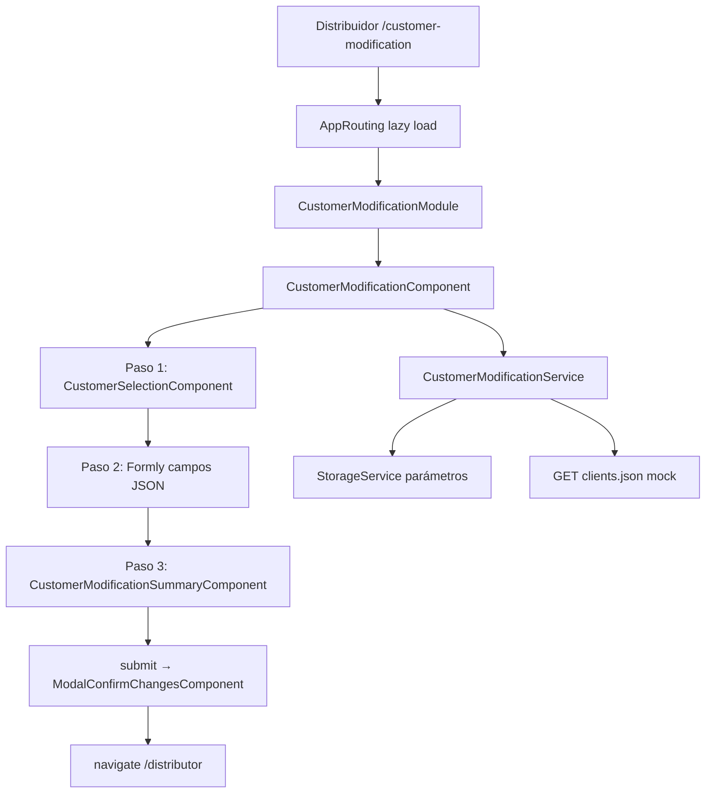

# Documentación — Modificar cliente bancario

Guía exhaustiva en español: **un archivo `.md` por cada fichero del proyecto**, con la misma estructura de carpetas que el código.

## Cómo leerla

1. Empieza por el **flujo general** (recomendado):
   - [`app-routing.module.ts.md`](src/app/app-routing.module.ts.md) → cómo se entra a la ruta
   - [`customer-modification.module.ts.md`](src/app/features/customer-modification/customer-modification.module.ts.md) → qué declara el módulo
   - [`customer-modification.component.ts.md`](src/app/features/customer-modification/components/customer-modification.component.ts.md) → cerebro del flujo (3 pasos)
2. Luego los **mocks** (datos de prueba):
   - [`clients.json.md`](api/public/mocks/v1/customer-modification/clients.json.md)
   - [`parameters-customer-modification.json.md`](api/public/mocks/v1/parameters-customer-modification.json.md)
3. Después los **componentes Formly** hijos y el **servicio**.

---

## Índice completo (32 documentos)

### API — mocks HTTP

| Archivo fuente | Documentación |
|----------------|---------------|
| `api/public/mocks/v1/customer-modification/clients.json` | [clients.json.md](api/public/mocks/v1/customer-modification/clients.json.md) |
| `api/public/mocks/v1/parameters-customer-modification.json` | [parameters-customer-modification.json.md](api/public/mocks/v1/parameters-customer-modification.json.md) |
| `api/public/mocks/v1/parameters.json` | [parameters.json.md](api/public/mocks/v1/parameters.json.md) |

### Stubs (tests)

| Archivo fuente | Documentación |
|----------------|---------------|
| `src/app/core/stubs/customer-modification.service.stub.ts` | [customer-modification.service.stub.ts.md](src/app/core/stubs/customer-modification.service.stub.ts.md) |
| `src/app/core/stubs/modal-services.stub.ts` | [modal-services.stub.ts.md](src/app/core/stubs/modal-services.stub.ts.md) |
| `src/app/core/stubs/utils-api.stub.ts` | [utils-api.stub.ts.md](src/app/core/stubs/utils-api.stub.ts.md) |

### Feature — componente principal

| Archivo fuente | Documentación |
|----------------|---------------|
| `customer-modification.component.ts` | [customer-modification.component.ts.md](src/app/features/customer-modification/components/customer-modification.component.ts.md) |
| `customer-modification.component.html` | [customer-modification.component.html.md](src/app/features/customer-modification/components/customer-modification.component.html.md) |
| `customer-modification.component.scss` | [customer-modification.component.scss.md](src/app/features/customer-modification/components/customer-modification.component.scss.md) |
| `customer-modification.component.spec.ts` | [customer-modification.component.spec.ts.md](src/app/features/customer-modification/components/customer-modification.component.spec.ts.md) |

### Feature — selección de cliente

| Archivo fuente | Documentación |
|----------------|---------------|
| `customer-selection.component.ts` | [customer-selection.component.ts.md](src/app/features/customer-modification/components/customer-selection/customer-selection.component.ts.md) |
| `customer-selection.component.html` | [customer-selection.component.html.md](src/app/features/customer-modification/components/customer-selection/customer-selection.component.html.md) |
| `customer-selection.component.scss` | [customer-selection.component.scss.md](src/app/features/customer-modification/components/customer-selection/customer-selection.component.scss.md) |
| `customer-selection.component.spec.ts` | [customer-selection.component.spec.ts.md](src/app/features/customer-modification/components/customer-selection/customer-selection.component.spec.ts.md) |

### Feature — resumen de cambios

| Archivo fuente | Documentación |
|----------------|---------------|
| `customer-modification-summary.component.ts` | [customer-modification-summary.component.ts.md](src/app/features/customer-modification/components/customer-modification-summary/customer-modification-summary.component.ts.md) |
| `customer-modification-summary.component.html` | [customer-modification-summary.component.html.md](src/app/features/customer-modification/components/customer-modification-summary/customer-modification-summary.component.html.md) |
| `customer-modification-summary.component.scss` | [customer-modification-summary.component.scss.md](src/app/features/customer-modification/components/customer-modification-summary/customer-modification-summary.component.scss.md) |
| `customer-modification-summary.component.spec.ts` | [customer-modification-summary.component.spec.ts.md](src/app/features/customer-modification/components/customer-modification-summary/customer-modification-summary.component.spec.ts.md) |

### Feature — modal de confirmación

| Archivo fuente | Documentación |
|----------------|---------------|
| `modal-confirm-changes.component.ts` | [modal-confirm-changes.component.ts.md](src/app/features/customer-modification/components/modal-confirm-changes/modal-confirm-changes.component.ts.md) |
| `modal-confirm-changes.component.html` | [modal-confirm-changes.component.html.md](src/app/features/customer-modification/components/modal-confirm-changes/modal-confirm-changes.component.html.md) |
| `modal-confirm-changes.component.scss` | [modal-confirm-changes.component.scss.md](src/app/features/customer-modification/components/modal-confirm-changes/modal-confirm-changes.component.scss.md) |
| `modal-confirm-changes.component.spec.ts` | [modal-confirm-changes.component.spec.ts.md](src/app/features/customer-modification/components/modal-confirm-changes/modal-confirm-changes.component.spec.ts.md) |

### Feature — servicio y validadores

| Archivo fuente | Documentación |
|----------------|---------------|
| `customer-modification.service.ts` | [customer-modification.service.ts.md](src/app/features/customer-modification/services/customer-modification.service.ts.md) |
| `customer-modification.service.spec.ts` | [customer-modification.service.spec.ts.md](src/app/features/customer-modification/services/customer-modification.service.spec.ts.md) |
| `customer-modification.validators.ts` | [customer-modification.validators.ts.md](src/app/features/customer-modification/validators/customer-modification.validators.ts.md) |

### Feature — módulo Angular

| Archivo fuente | Documentación |
|----------------|---------------|
| `customer-modification-routing.module.ts` | [customer-modification-routing.module.ts.md](src/app/features/customer-modification/customer-modification-routing.module.ts.md) |
| `customer-modification.module.ts` | [customer-modification.module.ts.md](src/app/features/customer-modification/customer-modification.module.ts.md) |

### Mocks TypeScript

| Archivo fuente | Documentación |
|----------------|---------------|
| `src/app/mocks/customer-modification-clients.mock.ts` | [customer-modification-clients.mock.ts.md](src/app/mocks/customer-modification-clients.mock.ts.md) |
| `src/app/mocks/index.ts` | [index.ts.md](src/app/mocks/index.ts.md) |

### App raíz

| Archivo fuente | Documentación |
|----------------|---------------|
| `src/app/app-routing.module.ts` | [app-routing.module.ts.md](src/app/app-routing.module.ts.md) |
| `src/app/app.module.ts` | [app.module.ts.md](src/app/app.module.ts.md) |

### Traducciones

| Archivo fuente | Documentación |
|----------------|---------------|
| `src/assets/i18n/es.json` | [es.json.md](src/assets/i18n/es.json.md) |

---

## Diagrama del flujo de la feature

---

## Convenciones de los documentos

- **Título H1** = nombre del archivo explicado.
- Al inicio de cada `.md` hay un bloque **Código fuente** con el fichero completo (referencia rápida).
- **Debajo de cada sección** (`##`, `###`, `####`) verás un bloque **Código:** con el fragmento exacto que se está explicando en ese párrafo — así puedes leer y tener el trozo a mano sin buscar en el proyecto.
- Enlaces cruzados entre ficheros relacionados.
- Glosario de términos (Formly, `formState`, stub, lazy load, etc.) repetido donde hace falta para lectura independiente de cada `.md`.
