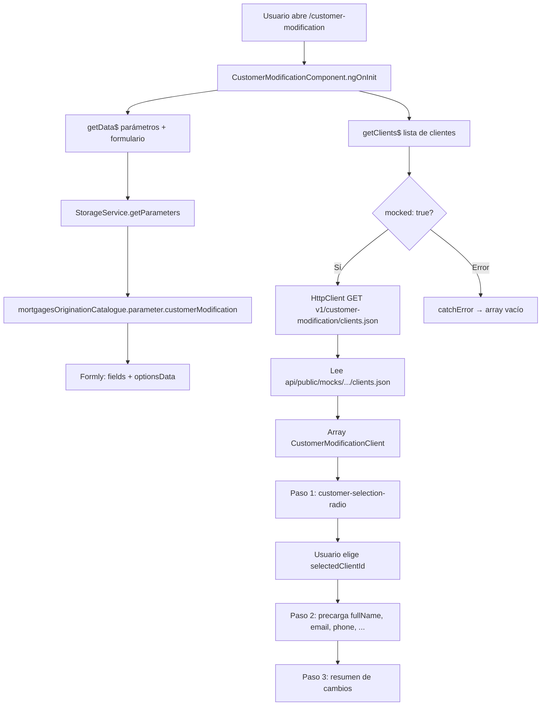

# Documentación: `api/public/mocks/v1/customer-modification/clients.json`

> **Cómo leer este documento:** debajo de cada explicación hay un bloque **Código:** con el fragmento exacto del fichero fuente.

## Código fuente

Archivo: `api/public/mocks/v1/customer-modification/clients.json`

```json
[
  {
    "id": 1,
    "fullName": "Jesús Félix",
    "document": "12345678A",
    "email": "jesus@test.com",
    "phone": "600123123",
    "accountNumber": "ES6621000418401234567891",
    "accountType": "Cuenta Nómina",
    "branchOffice": "Madrid Centro",
    "transferLimit": 3000,
    "notificationsEnabled": true,
    "preferredContactMethod": "EMAIL"
  },
  {
    "id": 2,
    "fullName": "María García López",
    "document": "87654321B",
    "email": "maria.garcia@test.com",
    "phone": "611234567",
    "accountNumber": "ES7620770024003102575766",
    "accountType": "Cuenta Ahorro",
    "branchOffice": "Barcelona Norte",
    "transferLimit": 1500,
    "notificationsEnabled": false,
    "preferredContactMethod": "PHONE"
  },
  {
    "id": 3,
    "fullName": "Carlos Ruiz Martínez",
    "document": "11223344C",
    "email": "carlos.ruiz@test.com",
    "phone": "622345678",
    "accountNumber": "ES9121000418450200051332",
    "accountType": "Cuenta Empresa",
    "branchOffice": "Sevilla Este",
    "transferLimit": 2000,
    "notificationsEnabled": true,
    "preferredContactMethod": "SMS"
  }
]
```

---

## Índice

1. [Propósito del archivo](#propósito-del-archivo)
2. [Ubicación y URL HTTP simulada](#ubicación-y-url-http-simulada)
3. [Conceptos básicos de JSON](#conceptos-básicos-de-json)
4. [Estructura del array de clientes](#estructura-del-array-de-clientes)
5. [Descripción de cada propiedad del cliente](#descripción-de-cada-propiedad-del-cliente)
6. [Los tres clientes de ejemplo](#los-tres-clientes-de-ejemplo)
7. [Conexión con la aplicación Angular](#conexión-con-la-aplicación-angular)
8. [Diagrama de flujo](#diagrama-de-flujo)
9. [Buenas prácticas al modificar el mock](#buenas-prácticas-al-modificar-el-mock)

---

## Propósito del archivo

Este archivo es un **mock de API**: datos ficticios que imitan la respuesta de un servicio backend real cuando la aplicación solicita la lista de clientes bancarios elegibles para modificación.

En desarrollo, la aplicación no llama a un servidor bancario real. En su lugar:

1. `CustomerModificationService.getClients$()` construye una petición HTTP GET.
2. La configuración indica `mocked: true`, lo que redirige la petición al fichero JSON local.
3. El navegador recibe el contenido de `clients.json` como si fuera la respuesta del endpoint **`GET v1/customer-modification/clients.json`**.

El sufijo `.json` lo añade automáticamente `UtilsApi.getEndPointUrl` cuando el endpoint está marcado como mock.

---

## Ubicación y URL HTTP simulada

| Concepto | Valor |
|----------|--------|
| Ruta en disco | `api/public/mocks/v1/customer-modification/clients.json` |
| URL lógica en código | `v1/customer-modification/clients` |
| URL efectiva del mock | `v1/customer-modification/clients.json` |
| Método HTTP | `GET` |
| Tipo de contenido esperado | `application/json` (array JSON) |

---

## Conceptos básicos de JSON

Antes de leer el contenido línea a línea, conviene entender la sintaxis que usa el archivo.

### Corchetes `[` y `]`

- El archivo **empieza con `[` y termina con `]`**.
- Eso significa que la raíz del documento es un **array** (lista ordenada de elementos).
- Cada elemento de la lista es un **objeto** (un cliente).

### Llaves `{` y `}`

- Cada cliente está envuelto en `{` … `}`.
- Dentro de las llaves van las **propiedades** del cliente (`id`, `fullName`, etc.).

### Comas `,`

- Separan elementos dentro del array o propiedades dentro de un objeto.
- **Regla importante:** la última propiedad de un objeto **no** lleva coma final.
- **Regla importante:** el último objeto del array **no** lleva coma después de su `}`.

Ejemplo simplificado de la estructura:

```json
[
  { "id": 1, "fullName": "..." },
  { "id": 2, "fullName": "..." }
]
```

### Comillas en claves y textos

- Los **nombres de propiedad** (`"id"`, `"fullName"`) van entre comillas dobles.
- Los **valores de texto** (`"Jesús Félix"`, `"EMAIL"`) también van entre comillas dobles.
- Los **números** (`1`, `3000`) y los **booleanos** (`true`, `false`) **no** llevan comillas.

### Dos puntos `:`

- Unen cada nombre de propiedad con su valor: `"id": 1` significa «la propiedad `id` vale `1`».

---

## Estructura del array de clientes

El fichero contiene **exactamente 3 objetos cliente**, en este orden:

| Índice en array | `id` | Nombre |
|-----------------|------|--------|
| 0 | 1 | Jesús Félix |
| 1 | 2 | María García López |
| 2 | 3 | Carlos Ruiz Martínez |

La aplicación usa el campo `id` como identificador único al seleccionar un cliente en el paso 1 del formulario (`selectedClientId`).

---

## Descripción de cada propiedad del cliente

Cada objeto del array comparte la misma forma. La interfaz TypeScript del proyecto es `CustomerModificationClient` (`src/app/shared/models/api/common/customer-modification.model.ts`).

### `id` (número)

- **Tipo JSON:** número entero, sin comillas.
- **Significado:** identificador único del cliente dentro de este mock.
- **Uso en la app:** el paso 1 del stepper guarda en el modelo el valor elegido en `selectedClientId`. El componente busca el cliente con `clients.find(c => c.id === selectedClientId)` para rellenar el paso 2.
- **Ejemplo en mock:** `1`, `2`, `3`.

**Código:**

```json
{
  "id": 1
}
```

### `fullName` (cadena de texto)

- **Tipo JSON:** string entre comillas.
- **Significado:** nombre y apellidos completos del titular.
- **Uso en la app:** se muestra en la lista de selección y se precarga en el campo `fullName` del paso 2. El validador `noNumbers` impide dígitos en el nombre al editar.
- **Ejemplo:** `"Jesús Félix"`.

**Código:**

```json
{
  "fullName": "Jesús Félix"
}
```

### `document` (cadena de texto)

- **Tipo JSON:** string.
- **Significado:** documento de identidad (DNI/NIE u otro identificador fiscal).
- **Uso en la app:** se muestra en la tarjeta de selección del cliente; en el JSON de parámetros del formulario **no** hay campo editable para `document` (solo lectura en la UI de selección).
- **Ejemplo:** `"12345678A"` (formato típico español: 8 dígitos + letra).

**Código:**

```json
{
  "document": "12345678A"
}
```

### `email` (cadena de texto)

- **Tipo JSON:** string con formato de correo.
- **Significado:** dirección de correo electrónico de contacto.
- **Uso en la app:** campo editable en paso 2; validador `emailFormat`.
- **Ejemplo:** `"jesus@test.com"`.

**Código:**

```json
{
  "email": "jesus@test.com"
}
```

### `phone` (cadena de texto)

- **Tipo JSON:** string (aunque parezca numérico, se guarda como texto).
- **Significado:** teléfono móvil o fijo de contacto.
- **Uso en la app:** campo editable; validadores `onlyNumbers` y `maxNineDigits` (máximo 9 dígitos).
- **Ejemplo:** `"600123123"`.

**Código:**

```json
{
  "phone": "600123123"
}
```

### `accountNumber` (cadena de texto)

- **Tipo JSON:** string.
- **Significado:** IBAN de la cuenta bancaria del cliente.
- **Uso en la app:** etiquetado como «IBAN» en i18n; validador `ibanFormat` (estructura y checksum mod-97).
- **Ejemplo:** `"ES6621000418401234567891"` (IBAN español que empieza por `ES`).

**Código:**

```json
{
  "accountNumber": "ES6621000418401234567891"
}
```

### `accountType` (cadena de texto)

- **Tipo JSON:** string.
- **Significado:** tipo comercial de la cuenta.
- **Uso en la app:** valor del desplegable `accountType`; debe coincidir con uno de los `value` de `optionsData.accountTypeOptions` en el JSON de parámetros (por ejemplo `"Cuenta Nómina"`).
- **Valores en mock:** `Cuenta Nómina`, `Cuenta Ahorro`, `Cuenta Empresa`.

**Código:**

```json
{
  "accountType": "Cuenta Nómina"
}
```

### `branchOffice` (cadena de texto)

- **Tipo JSON:** string.
- **Significado:** oficina o sucursal asociada al cliente.
- **Uso en la app:** selector modal `branchOffice`; valores alineados con `branchOfficeOptions` en parámetros.
- **Ejemplo:** `"Madrid Centro"`.

**Código:**

```json
{
  "branchOffice": "Madrid Centro"
}
```

### `transferLimit` (número)

- **Tipo JSON:** número (sin comillas).
- **Significado:** límite diario o operativo de transferencias, en la unidad que defina el negocio (euros en el contexto del mock).
- **Uso en la app:** input numérico con validador `transferLimitRange` (entre 0 y 3000).
- **Ejemplos en mock:** `3000`, `1500`, `2000`.

**Código:**

```json
{
  "transferLimit": 3000
}
```

### `notificationsEnabled` (booleano)

- **Tipo JSON:** `true` o `false` (palabras reservadas, sin comillas).
- **Significado:** si el cliente tiene activadas las notificaciones bancarias.
- **Uso en la app:** interruptor (`switch`) en el paso 2; valor por defecto del formulario para nuevos modelos es `false`, pero al seleccionar cliente se sobrescribe con el del mock.
- **Ejemplos:** `true`, `false`.

**Código:**

```json
{
  "notificationsEnabled": true
}
```

### `preferredContactMethod` (cadena de texto)

- **Tipo JSON:** string en mayúsculas.
- **Significado:** canal preferido para contactar al cliente.
- **Valores permitidos en mock y opciones:** `"EMAIL"`, `"PHONE"`, `"SMS"`.
- **Uso en la app:** grupo de botones tipo radio (`button-toggle`); debe coincidir con `preferredContactMethodOptions` en parámetros.

---

**Código:**

```json
{
  "preferredContactMethod": "EMAIL"
}
```

## Los tres clientes de ejemplo


### Cliente 1 — Jesús Félix

- Cuenta nómina en Madrid Centro.
- Límite 3000 €, notificaciones activas, contacto por email.
- Sirve como caso «completo» y con límite máximo.

### Cliente 2 — María García López

- Cuenta ahorro en Barcelona Norte.
- Límite 1500 €, notificaciones desactivadas, contacto por teléfono.
- Sirve para probar valores distintos en switch y toggle.

### Cliente 3 — Carlos Ruiz Martínez

- Cuenta empresa en Sevilla Este.
- Límite 2000 €, notificaciones activas, contacto por SMS.
- Completa la cobertura de los tres canales de contacto.

---

## Conexión con la aplicación Angular


### `CustomerModificationService.getClients$()`

Definido en `src/app/features/customer-modification/services/customer-modification.service.ts`:

```typescript
getClients$(): Observable<CustomerModificationClient[]> {
  const config = {
    url: 'v1/customer-modification/clients',
    urlMock: 'v1/customer-modification/clients',
    mocked: true,
    httpMethod: HttpMethodEnum.get,
  };
  // ...
  return this._http.request(..., this._utilsApiService.getEndPointUrl(config), ...);
}
```

- **`mocked: true`:** activa la resolución hacia el fichero bajo `api/public/mocks/`.
- **`catchError(() => of([]))`:** si el mock falla, la app recibe un array vacío y muestra el mensaje «No hay clientes disponibles».

### Quién consume el observable

`CustomerModificationComponent` llama a `getClients$()` en `_loadClients()` tras cargar parámetros y configuración del formulario. Los clientes se guardan en `this._clients` y alimentan el componente `customer-selection-radio`.

### `CUSTOMER_MODIFICATION_CLIENTS_MOCK`

Definido en `src/app/mocks/customer-modification-clients.mock.ts` y exportado desde `src/app/mocks/index.ts`.

| Aspecto | `clients.json` (API mock) | `CUSTOMER_MODIFICATION_CLIENTS_MOCK` (TypeScript) |
|---------|---------------------------|---------------------------------------------------|
| Formato | JSON en disco | Array tipado en código |
| Cuándo se usa | Petición HTTP real en dev con mocks activos | Tests unitarios y stub del servicio |
| Contenido | Mismos 3 clientes, mismos campos | Copia idéntica para no duplicar lógica en tests |

El stub `customer-modification.service.stub.ts` implementa:

```typescript
getClients$: (): Observable<any> => of(CUSTOMER_MODIFICATION_CLIENTS_MOCK),
```

Así los tests no necesitan `HttpClient` ni el fichero JSON del servidor estático.

**Recomendación:** si añades o cambias un cliente en `clients.json`, actualiza también `CUSTOMER_MODIFICATION_CLIENTS_MOCK` para mantener tests y desarrollo alineados.

---

## Diagrama de flujo



---

## Buenas prácticas al modificar el mock

1. **Mantener `id` únicos** entre objetos del array.
2. **Alinear** `accountType` y `branchOffice` con los `value` definidos en `parameters-customer-modification.json` → `optionsData`.
3. **Respetar** `preferredContactMethod` ∈ `{ EMAIL, PHONE, SMS }`.
4. **IBAN válidos** si quieres pasar validación en paso 2 (checksum mod-97).
5. **Sincronizar** el mock TypeScript en `customer-modification-clients.mock.ts` tras cambios en este JSON.
6. **Validar JSON** con un linter (coma final, comillas) antes de guardar; un JSON inválido rompe la carga del mock.

---

## Archivo fuente

Ruta: `api/public/mocks/v1/customer-modification/clients.json`

Documentación relacionada:

- [parameters-customer-modification.json.md](../parameters-customer-modification.json.md) — configuración del formulario que edita estos clientes.
- [parameters.json.md](../parameters.json.md) — copia de integración del catálogo de parámetros.
