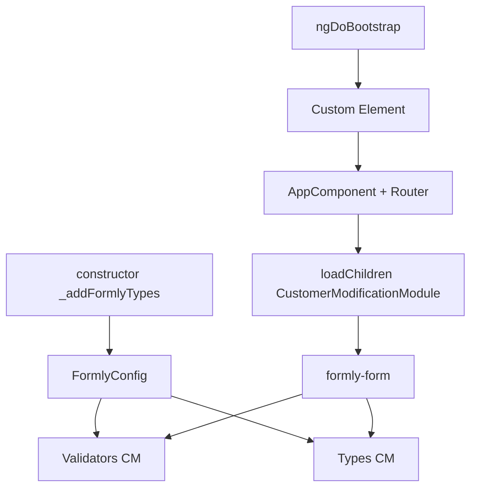

# `app.module.ts` — Customer Modification y bootstrap

> **Cómo leer este documento:** debajo de cada explicación hay un bloque **Código:** con el fragmento exacto del fichero fuente.

## Código fuente

Archivo: `src/app/app.module.ts`

```typescript
/* eslint-disable @typescript-eslint/naming-convention */
import { DatePipe, LocationStrategy, PlatformLocation, registerLocaleData } from '@angular/common';
import { HTTP_INTERCEPTORS, HttpClient, provideHttpClient, withInterceptorsFromDi } from '@angular/common/http';
import localeCaES from '@angular/common/locales/ca';
import localeEnGB from '@angular/common/locales/en-GB';
import localeEsES from '@angular/common/locales/es';
import localeEuES from '@angular/common/locales/eu';
import localeFrFR from '@angular/common/locales/fr';
import localeGlES from '@angular/common/locales/gl';
import localeItIT from '@angular/common/locales/it';
import localePlPL from '@angular/common/locales/pl';
import localePtPT from '@angular/common/locales/pt-PT';
import { DoBootstrap, Injector, LOCALE_ID, NgModule, inject } from '@angular/core';
import { createCustomElement } from '@angular/elements';
import { BrowserModule } from '@angular/platform-browser';
import { provideAnimationsAsync } from '@angular/platform-browser/animations/async';
import { MicrofrontModule, MountPathPipe, locationStrategyFactory } from '@ng-darwin-wmf/microfront';
import { ConfigModule, ConfigService } from '@ng-darwin/config';
import { LoggerModule } from '@ng-darwin/logger';
import { SecurityLiteModule } from '@ng-darwin/security';
import { FormlyConfig } from '@ngx-formly/core';
import { TranslateLoader, TranslateModule } from '@ngx-translate/core';
import {
  CoreModule as CoreModuleLib,
  FillAllObjectWithPathPipe,
  FormlyFieldTypes,
  GetDatePatternPipe,
  GetValueObjectWithPathPipe,
  HomeurFormlyModule,
  LocaleService,
  NavigationType,
  OriginService,
  SharedModule,
  SpinnerFullOverlayModule,
  StorageService,
} from '@sanes-hipdig/lf-ng-50084125-front-compones';
import { CookieModule } from 'ngx-cookie';
import { environment } from 'src/environments/environment';
import { AppRoutingModule } from './app-routing.module';
import { AppComponent } from './app.component';
import { HttpCustomInterceptor } from './core/interceptor/http-custom.interceptor';
import { LocaleId } from './core/models/locale.model';
import { CustomTranslateLoader } from './core/services/translate.loader';
import { BrandHeaderModule } from './shared/components/brand-header/brand-header.module';
import { CallMeModule } from './shared/components/call-me/call-me.module';
import { FormlyFieldIncreaseFinancingAmountComponent } from './shared/types/increase-financing-amount/increase-financing-amount.component';
import { FormlyFieldTabsComponent } from './shared/types/tabs/tabs.component';
import { FormlyFieldTemplatesFinancingComponent } from './shared/types/templates-financing/templates-financing.component';
import { Utils } from './shared/utils/utils';
import { ExcludeFieldComponent } from './shared/wrappers/exclude-components/exclude-field.component';
import { FormlyFieldNovationSelectMortgageRadioButtonComponent } from './shared/types/novation-select-mortgage-radio-button/novation-select-mortgage-radio-button.component';
import { FormlyFieldNovationParticipantsMultiCheckboxComponent } from './shared/types/novation-participants-multicheckbox/novation-participants-multicheckbox.component';
import { FormlyFieldNovationSummaryParticipantsInfoComponent } from './shared/types/novation-summary-participants-info/novation-summary-participants-info.component';
import { CustomerSelectionComponent } from './features/customer-modification/components/customer-selection/customer-selection.component';
import { CustomerModificationSummaryComponent } from './features/customer-modification/components/customer-modification-summary/customer-modification-summary.component';
import {
  emailFormatValidator,
  ibanFormatValidator,
  maxNineDigitsValidator,
  noNumbersValidator,
  onlyNumbersValidator,
  transferLimitRangeValidator,
} from './features/customer-modification/validators/customer-modification.validators';

// XXX: register locale data for pipes and diferent languages
registerLocaleData(localeCaES, 'ca');
registerLocaleData(localeEnGB, 'en');
registerLocaleData(localeEsES, 'es');
registerLocaleData(localeEuES, 'eu');
registerLocaleData(localeFrFR, 'fr');
registerLocaleData(localeGlES, 'gl');
registerLocaleData(localeItIT, 'it');
registerLocaleData(localePlPL, 'pl');
registerLocaleData(localePtPT, 'pt');

/**
 * AppModule
 * Designed to be the root module.
 *
 * imports:
 *  - BrowserModule. Required infrastructure for all Angular apps.
 *  - HttpClientModule. Configures the DI for HttpClient.
 *  - ConfigModule. Configures the DI for ConfigService..
 *  - SecurityModule. Configures the DI for SecurityServiceLite
 *  - LoggerModule. Configures the DI for LoggerService.
 *  - AppRoutingModule. Module with the configured routes
 *
 * declarations:
 *  - AppComponent. Root component in charge of being the app shell.
 *  - DwComponent. Root component for Darwin app.
 *
 * bootstrap:
 *   - AppComponent
 */
@NgModule({
  declarations: [AppComponent],
  imports: [
    BrowserModule,
    CoreModuleLib.forRoot({
      config: {
        environment: environment,
        microFront: true,
        technicalGrouping: 'mf-ng-50078458-homeplanner',
        tagMicrofront: 'homeur-mf-ng-50078458-homeplanner',
        language: {
          cookie: '_dwlan',
        },
        interceptor: {
          useTokenDatos: true,
        },
        tealiumConfig: {
          standaloneKey: 'utag_data',
          shellEmbeddedKey: 'mf-ng-50078458-homeplanner_utag_data',
        },
        infoError: {
          navigationType: NavigationType.internalNavigate,
          acceptLabel: 'ERRORS.GENERIC.GLOBAL_POSITION',
          title: 'ERRORS.GENERIC.DISPLAY_TITLE',
          message: 'ERRORS.GENERIC.DISPLAY_MESSAGE',
        },
      },
    }),
    SharedModule,
    HomeurFormlyModule,
    ConfigModule.forRoot({
      technicalGrouping: 'mf-ng-50078458-homeplanner',
      logEvent: {
        level: 1,
        handler(log): void {
          console.log('app.module.ts: Log event from Config module', log); // eslint-disable-line no-console
        },
      },
      errorEvent: {
        handler(err): void {
          console.log('app.module.ts: Error event from Config module', err); // eslint-disable-line no-console
        },
      },
      configLoadedEvent: {
        handler(config): void {
          console.log('app.module.ts: ConfigLoadedEvent from Config module', config); // eslint-disable-line no-console
        },
      },
    }),
    SecurityLiteModule,
    LoggerModule,
    MicrofrontModule,
    AppRoutingModule,
    SpinnerFullOverlayModule,
    CallMeModule,
    BrandHeaderModule,
    CookieModule.withOptions(),
    TranslateModule.forRoot({
      loader: {
        provide: TranslateLoader,
        useClass: CustomTranslateLoader,
        deps: [HttpClient],
      },
    }),
  ],
  providers: [
    { provide: LocationStrategy, useFactory: locationStrategyFactory, deps: [PlatformLocation] },
    {
      provide: LOCALE_ID,
      useClass: LocaleId,
      deps: [LocaleService],
    },
    provideHttpClient(withInterceptorsFromDi()),
    {
      provide: HTTP_INTERCEPTORS,
      useClass: HttpCustomInterceptor,
      deps: [ConfigService, OriginService, StorageService],
      multi: true,
    },
    provideAnimationsAsync(),
    DatePipe,
    GetDatePatternPipe,
    Utils,
    GetValueObjectWithPathPipe,
    FillAllObjectWithPathPipe,
    MountPathPipe,
  ],
})
export class AppModule implements DoBootstrap {
  private _injector = inject(Injector);
  private readonly _formlyConfig = inject(FormlyConfig);

  /**
   * Constructor
   */
  constructor() {
    this._addFormlyTypes();
  }

  /**
   * add custom types to formly.
   * This is a way to extend the formly library with custom types for Home planner
   */
  private _addFormlyTypes(): void {
    this._formlyConfig.addConfig({
      wrappers: [{ name: 'objectDataOrArryaData', component: ExcludeFieldComponent }],
      types: [
        {
          name: FormlyFieldTypes.increaseFinancingAmount,
          component: FormlyFieldIncreaseFinancingAmountComponent,
        },
        {
          name: FormlyFieldTypes.templatesFinancing,
          component: FormlyFieldTemplatesFinancingComponent,
        },
        {
          name: 'tabs-attracting',
          component: FormlyFieldTabsComponent,
        },
        {
          name: 'novation-select-mortgage-radio-button',
          component: FormlyFieldNovationSelectMortgageRadioButtonComponent,
        },
        {
          name: 'novation-participants-multicheckbox',
          component: FormlyFieldNovationParticipantsMultiCheckboxComponent,
        },
        {
          name: 'novation-summary-participants-info',
          component: FormlyFieldNovationSummaryParticipantsInfoComponent,
        },
        {
          name: 'customer-selection-radio',
          component: CustomerSelectionComponent,
        },
        {
          name: 'customer-modification-summary',
          component: CustomerModificationSummaryComponent,
        },
      ],
      validators: [
        { name: 'noNumbers', validation: noNumbersValidator },
        { name: 'emailFormat', validation: emailFormatValidator },
        { name: 'onlyNumbers', validation: onlyNumbersValidator },
        { name: 'maxNineDigits', validation: maxNineDigitsValidator },
        { name: 'ibanFormat', validation: ibanFormatValidator },
        { name: 'transferLimitRange', validation: transferLimitRangeValidator },
      ],
      validationMessages: [
        { name: 'noNumbers', message: 'CUSTOMER_MODIFICATION.VALIDATORS.NO_NUMBERS' },
        { name: 'emailFormat', message: 'CUSTOMER_MODIFICATION.VALIDATORS.EMAIL_FORMAT' },
        { name: 'onlyNumbers', message: 'CUSTOMER_MODIFICATION.VALIDATORS.ONLY_NUMBERS' },
        { name: 'maxNineDigits', message: 'CUSTOMER_MODIFICATION.VALIDATORS.MAX_NINE_DIGITS' },
        { name: 'ibanFormat', message: 'CUSTOMER_MODIFICATION.VALIDATORS.IBAN_FORMAT' },
        { name: 'transferLimitRange', message: 'CUSTOMER_MODIFICATION.VALIDATORS.TRANSFER_LIMIT_RANGE' },
      ],
    });
  }

  /**
   * Hook for manual ngDoBootstrap
   * It will create the Angular Element (a native Web Component)
   */
  ngDoBootstrap(): void {
    const ce = createCustomElement(AppComponent, { injector: this._injector });
    // IMPORTANT: this name must be unique per microfront
    const tagName = 'homeur-mf-ng-50078458-homeplanner';

    if (!customElements.get(tagName)) {
      customElements.define(tagName, ce);
    } else {
      // eslint-disable-next-line no-console
      console.warn(`${tagName} component is already define. This should not happen, the component should be defined only one time.`);
    }
  }
}
```

---

**Ruta fuente:** `src/app/app.module.ts`

Enfoque en:

1. Registro de **tipos Formly** y **validadores** de modificación de cliente.
2. **`ngDoBootstrap`** y custom element del microfrontend.

---

## Imports relevantes (customer modification)

```typescript
import { CustomerSelectionComponent } from './features/customer-modification/components/customer-selection/customer-selection.component';
import { CustomerModificationSummaryComponent } from './features/customer-modification/components/customer-modification-summary/customer-modification-summary.component';
import {
  emailFormatValidator,
  ibanFormatValidator,
  maxNineDigitsValidator,
  noNumbersValidator,
  onlyNumbersValidator,
  transferLimitRangeValidator,
} from './features/customer-modification/validators/customer-modification.validators';
```

Los componentes del modal y del contenedor principal **no** se importan aquí: viven en `CustomerModificationModule`.

---

## Constructor y `_addFormlyTypes()`

```typescript
constructor() {
  this._addFormlyTypes();
}
```

Se ejecuta al instanciar `AppModule`, **antes** de `ngDoBootstrap`, garantizando que Formly conozca tipos y validadores antes de cualquier formulario lazy-loaded.

`FormlyConfig` se inyecta con `inject(FormlyConfig)` en la propiedad `_formlyConfig`.

---

## Tipos Formly — customer modification

Dentro de `types: [ ... ]`:

### `customer-selection-radio`

```typescript
{
  name: 'customer-selection-radio',
  component: CustomerSelectionComponent,
},
```

- Usado en JSON: `"type": "customer-selection-radio"` en campo `selectedClientId`.
- Extiende `FieldType` de Formly.
- Lee `formState.clients` y `formState.selectOptionsData.accountTypeOptions`.

### `customer-modification-summary`

```typescript
{
  name: 'customer-modification-summary',
  component: CustomerModificationSummaryComponent,
},
```

- Paso 3 del stepper.
- Lee `formState.changes` poblado por `CustomerModificationComponent.loadSummaryStep()`.

Otros tipos en el mismo bloque (novación, financing, tabs) son independientes de esta feature.

---

## Validadores Formly

```typescript
validators: [
  { name: 'noNumbers', validation: noNumbersValidator },
  { name: 'emailFormat', validation: emailFormatValidator },
  { name: 'onlyNumbers', validation: onlyNumbersValidator },
  { name: 'maxNineDigits', validation: maxNineDigitsValidator },
  { name: 'ibanFormat', validation: ibanFormatValidator },
  { name: 'transferLimitRange', validation: transferLimitRangeValidator },
],
```

En el JSON del catálogo:

```json
"validators": {
  "validation": [{ "name": "ibanFormat" }]
}
```

Formly enlaza el **nombre** con la función registrada.

---

## Mensajes de validación

```typescript
validationMessages: [
  { name: 'noNumbers', message: 'CUSTOMER_MODIFICATION.VALIDATORS.NO_NUMBERS' },
  { name: 'emailFormat', message: 'CUSTOMER_MODIFICATION.VALIDATORS.EMAIL_FORMAT' },
  { name: 'onlyNumbers', message: 'CUSTOMER_MODIFICATION.VALIDATORS.ONLY_NUMBERS' },
  { name: 'maxNineDigits', message: 'CUSTOMER_MODIFICATION.VALIDATORS.MAX_NINE_DIGITS' },
  { name: 'ibanFormat', message: 'CUSTOMER_MODIFICATION.VALIDATORS.IBAN_FORMAT' },
  { name: 'transferLimitRange', message: 'CUSTOMER_MODIFICATION.VALIDATORS.TRANSFER_LIMIT_RANGE' },
],
```

Las cadenas son **claves** `@ngx-translate`, no texto literal. Documentación completa en `es.json.md`.

---

## Por qué validadores en AppModule y no en CustomerModificationModule

- El MF usa **`DoBootstrap`** sin `bootstrap: [AppComponent]` clásico en el mismo sentido que una SPA standalone.
- La configuración Formly es **global** para todos los features lazy.
- Los chunks lazy cargan componentes que referencian validadores por nombre; deben existir antes del primer `formly-form`.

---

## `ngDoBootstrap()`

```typescript
ngDoBootstrap(): void {
  const ce = createCustomElement(AppComponent, { injector: this._injector });
  const tagName = 'homeur-mf-ng-50078458-homeplanner';

  if (!customElements.get(tagName)) {
    customElements.define(tagName, ce);
  } else {
    console.warn(`${tagName} component is already define...`);
  }
}
```

### Flujo

1. **`AppModule` implementa `DoBootstrap`** — Angular no bootstrapea automáticamente un componente raíz listado en `@NgModule.bootstrap`.
2. **`createCustomElement(AppComponent, { injector })`** — envuelve `AppComponent` como **Web Component** nativo (Angular Elements).
3. **`customElements.define(tagName, ce)`** — registra el tag único del microfrontend.
4. El **shell** inserta `<homeur-mf-ng-50078458-homeplanner>` en el DOM; dentro vive el router con `AppRoutingModule`, incluida la ruta lazy `customer-modification`.

### Relación con customer modification

Cuando el shell carga el MF y navega a modificación de cliente:

- El injector raíz ya tiene Formly configurado (constructor).
- El lazy module añade declaraciones de componentes hijos.
- Los tipos `customer-selection-radio` y `customer-modification-summary` ya están registrados.

### Advertencia de doble registro

Si `define` se llama dos veces (hot reload o doble carga del script), se emite `console.warn` y no se redefine.

---

## Otros elementos del AppModule (contexto)

| Elemento | Relevancia para la feature |
|----------|----------------------------|
| `CoreModuleLib.forRoot` | Config microfront, Tealium, interceptor token |
| `HomeurFormlyModule` | Base Formly bancaria |
| `TranslateModule.forRoot` + `CustomTranslateLoader` | Carga `es.json` con claves `CUSTOMER_MODIFICATION.*` |
| `AppRoutingModule` | Lazy route |
| `MicrofrontModule` | Integración Darwin WMF |

---

## Diagrama bootstrap + Formly



---

## Checklist desarrollo

- Añadir validador: función en `validators/`, entrada en `validators` + `validationMessages`, clave en `es.json`.
- Añadir tipo Formly: componente + `declarations` en feature module + registro en `_addFormlyTypes`.
- No registrar tipos solo en `CustomerModificationModule` — no funcionará con la config actual.
