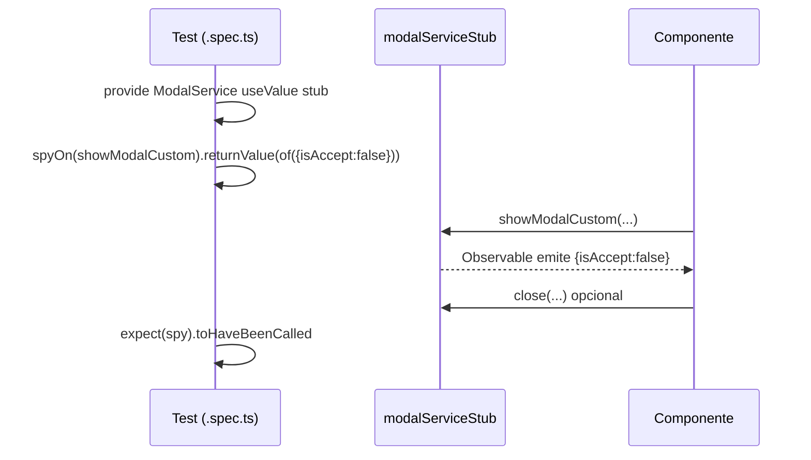

# Stub: `modal-services.stub.ts`

> **Cómo leer este documento:** debajo de cada explicación hay un bloque **Código:** con el fragmento exacto del fichero fuente.

## Código fuente

Archivo: `src/app/core/stubs/modal-services.stub.ts`

```typescript
import { of } from 'rxjs';

export const modalServiceStub = {
  showModal: (): any => of({}),
  showModalCustom: (): any => of(true),
  confirm: (): any => of({}),
  close: (): any => null,
};
```

---

**Archivo fuente:** `src/app/core/stubs/modal-services.stub.ts`  
**Propósito:** Sustituir `ModalService` de la librería `@sanes-hipdig/lf-ng-50084125-front-compones` en pruebas unitarias, sin abrir ventanas modales reales ni depender del DOM del design system.

---

## ¿Qué problema resuelve?

`ModalService` en producción:

- Abre diálogos en pantalla.
- Devuelve Observables cuando el usuario confirma o cancela.
- Coordina cierre y resultado (`{ isAccept: true }`, etc.).

En un test de Jasmine/Karma no quieres modales visuales ni tiempos de animación. El stub devuelve respuestas **síncronas-instantáneas** con RxJS `of()` o `null` donde no hace falta Observable.

---

## Explicación línea por línea


### Línea 1: `import { of } from 'rxjs';`

Solo se importa `of` (no `Observable` explícito). Los métodos que «emiten» usan `of(...)` para crear un Observable que entrega un valor y termina.

**Analogía:** `of(x)` es como decir «el modal ya respondió con `x`» sin que el usuario haya hecho clic.

---

### Línea 3: `export const modalServiceStub = {`

Objeto exportado registrado en tests como:

```typescript
{ provide: ModalService, useValue: modalServiceStub }
```

Angular inyecta este objeto en lugar de la implementación real de la librería.

---

### Línea 4: `showModal: (): any => of({}),`

| Aspecto | Detalle |
|---------|---------|
| **Método real (típico)** | Muestra un modal estándar con plantilla/mensaje y devuelve un Observable con el resultado de la interacción. |
| **Stub** | Devuelve `of({})`: un Observable que emite un **objeto vacío** `{}`. |
| **Tipo de retorno `any`** | Relaja TypeScript en el stub; los tests no validan la forma exacta salvo que hagan spy. |
| **Uso en customer-modification** | Esta feature usa sobre todo `showModalCustom`; `showModal` queda disponible por compatibilidad con la API del servicio. |

**RxJS:** `of({})` → una emisión `{}` → `complete`. Cualquier `.subscribe(result => ...)` recibe `{}`.

---

### Línea 5: `showModalCustom: (): any => of(true),`

| Aspecto | Detalle |
|---------|---------|
| **Método real** | Abre un componente Angular personalizado como modal (en esta app: `ModalConfirmChangesComponent`). Devuelve Observable con el payload al cerrar (p. ej. `{ isAccept: boolean }`). |
| **Stub por defecto** | `of(true)` — emite el booleano `true`, no `{ isAccept: true }`. |
| **En producción** | `customer-modification.component.ts` hace `.showModalCustom(ModalConfirmChangesComponent, { ... }).subscribe(...)`. |
| **En tests** | Casi siempre se **sobrescribe** con spy, porque el valor por defecto no coincide con la forma real: |

```typescript
spyOn(modalService, 'showModalCustom').and.returnValue(of({ isAccept: false }));
// o
(modalService.showModalCustom as jasmine.Spy).and.returnValue(of({ isAccept: true }));
```

**Propósito del stub base:** Que `TestBed` no falle si algún código llama `showModalCustom` sin spy; que exista un Observable devuelto. El valor `true` es un placeholder mínimo.

---

### Línea 6: `confirm: (): any => of({}),`

| Aspecto | Detalle |
|---------|---------|
| **Método real** | Modal de confirmación sí/no (patrón común en librerías UI). |
| **Stub** | `of({})` — confirmación «genérica» sin significado concreto. |
| **Tests** | Si un test necesita simular «usuario aceptó», se usa `spyOn(modalService, 'confirm').and.returnValue(of({ accepted: true }))` o similar según la API real. |

---

### Línea 7: `close: (): any => null,`

| Aspecto | Detalle |
|---------|---------|
| **Método real** | Cierra el modal activo y puede pasar datos de vuelta al suscriptor que abrió el modal. |
| **Stub** | Devuelve **`null`**, no un Observable. |
| **Por qué** | `close` en muchos diseños es **void** o efecto secundario: cerrar UI. No hace falta que el test espere un stream. |
| **Uso real en la app** | `modal-confirm-changes.component.ts`: `this._modalService.close({ isAccept: true });` |
| **Test** | `modal-confirm-changes.component.spec.ts` hace `spyOn(modalService, 'close')` y verifica `toHaveBeenCalledWith({ isAccept: true })`. El stub solo evita error si se llama `close` sin spy. |

**Nota para principiantes:** Mezclar `of(...)` en métodos que «emiten» y `null` en métodos «fire-and-forget» es habitual en stubs: imita que no todo el API del servicio es Observable.

---

## RxJS `of()` en este archivo — resumen

| Expresión | Qué hace en el test |
|-----------|---------------------|
| `of({})` | «El modal terminó» con objeto vacío. |
| `of(true)` | «El modal terminó» con `true`. |
| `null` en `close` | No hay flujo; solo ejecutar cierre simulado. |

**No se usa:** `throwError`, `timer`, `defer` — el stub prioriza simplicidad y determinismo.

---

## Propósito en testing (flujo mental)



1. **Arranque:** `TestBed` inyecta el stub → no hay overlay real.  
2. **Comportamiento fino:** `spyOn` sustituye la implementación del stub para cada caso.  
3. **Aserciones:** Se comprueba que se llamó al método correcto con los argumentos esperados (`showModalCustom` con `ModalConfirmChangesComponent`, etc.).

---

## Archivos que lo usan

| Archivo | Uso |
|---------|-----|
| `customer-modification.component.spec.ts` | Provider + spy en `showModalCustom` |
| `modal-confirm-changes.component.spec.ts` | Provider + spy en `close` |

---

## Resumen para principiantes

- El stub **sustituye** el servicio de modales de la librería compartida.  
- `showModal`, `showModalCustom` y `confirm` devuelven **Observables instantáneos** con `of()`.  
- `close` devuelve **`null`** porque cerrar suele ser un efecto, no un stream.  
- Los tests importantes **redefinen** `showModalCustom` con `spyOn` para devolver `{ isAccept: true | false }`, que es lo que el flujo de negocio espera.
