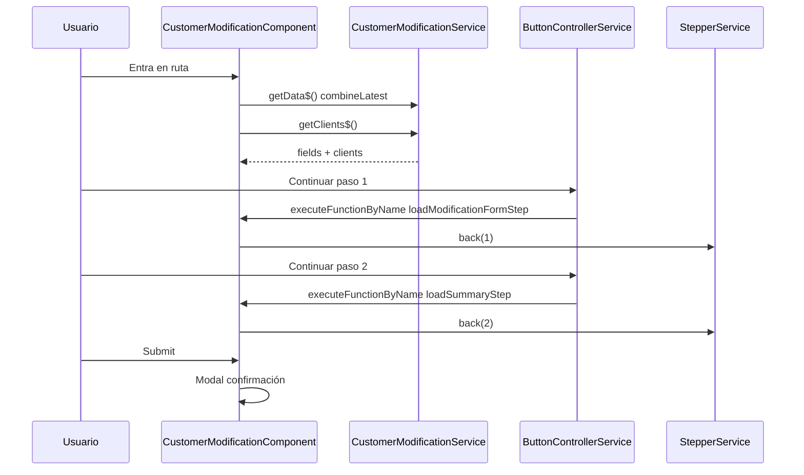

# `customer-modification.component.ts`

> **Cómo leer este documento:** debajo de cada explicación hay un bloque **Código:** con el fragmento exacto del fichero fuente.

## Código fuente

Archivo: `src/app/features/customer-modification/components/customer-modification.component.ts`

```typescript
/* eslint-disable @typescript-eslint/naming-convention */
import { Component, OnDestroy, OnInit, inject } from '@angular/core';
import { FormGroup } from '@angular/forms';
import { Router } from '@angular/router';
import { FormlyFieldConfig, FormlyFormOptions } from '@ngx-formly/core';
import {
  ButtonControllerService,
  CommunicationService,
  EventsControllerService,
  ModalService,
  StepperService,
  WindowRef,
} from '@sanes-hipdig/lf-ng-50084125-front-compones';
import { Subject, takeUntil } from 'rxjs';
import { TealiumDataService } from '../../../core/services/metrics/tealium-data.service';
import { CustomerModificationClient } from '../../../shared/models/api/common/customer-modification.model';
import { TranslateOptionsService } from '../../../shared/services/translate-options.service';
import { ModalConfirmChangesComponent } from './modal-confirm-changes/modal-confirm-changes.component';
import { CustomerModificationService } from '../services/customer-modification.service';

type CustomerModificationOption = {
  value: boolean | number | string;
  label: string;
};

type CustomerModificationChange = {
  fieldKey: string;
  label: string;
  oldValue: any;
  newValue: any;
};

/**
 * CustomerModificationComponent
 *
 * Main entry point for the "Modificar cliente bancario" feature.
 * It hosts a three-step Formly stepper:
 *   1. Client selection     – loads clients from mock and shows a radio list.
 *   2. Modification form    – pre-filled with the selected client data.
 *   3. Summary              – diff between original and modified values.
 *
 * Follows the same architecture as NovationComponent.
 */
@Component({
  standalone: false,
  selector: 'homeur-customer-modification',
  templateUrl: './customer-modification.component.html',
  styleUrls: ['./customer-modification.component.scss'],
})
export class CustomerModificationComponent implements OnInit, OnDestroy {
  private readonly _windowRef = inject(WindowRef);
  private readonly _customerModificationService = inject(CustomerModificationService);
  private readonly _translateOptionsService = inject(TranslateOptionsService);
  private readonly _buttonControllerService = inject(ButtonControllerService);
  private readonly _eventController = inject(EventsControllerService);
  private readonly _stepperService = inject(StepperService);
  private readonly _modalService = inject(ModalService);
  private readonly _communicationService = inject(CommunicationService);
  private readonly _tealiumDataService = inject(TealiumDataService);
  private readonly _router = inject(Router);

  private readonly _unsubscribe: Subject<void> = new Subject();

  /** Fields holding client data before the user edits it – used for the diff in step 3. */
  private _originalClientData: CustomerModificationClient | null = null;
  private _clients: CustomerModificationClient[] = [];
  private _translatedOptionsData: Record<string, CustomerModificationOption[]> = {};

  form!: FormGroup;
  model: any = {};
  fields: FormlyFieldConfig[] = [];
  options!: FormlyFormOptions;
  isAppIntoIFrame!: boolean;
  isDataReady = false;

  /**
   * OnInit
   */
  ngOnInit(): void {
    // Register event names so ButtonControllerService can dispatch them by string name.
    this._eventController.setEventMap('loadModificationFormStep', 'loadModificationFormStep');
    this._eventController.setEventMap('loadSummaryStep', 'loadSummaryStep');
    this._eventController.setEventMap('cancelCustomerModification', 'cancelCustomerModification');

    this._initializeDataSurvey();
    this._subscribeToButtonController();
    this._tealiumDataService.executeTealium('customerModification.views', 'selectClient');
  }

  /**
   * OnDestroy
   */
  ngOnDestroy(): void {
    this._unsubscribe.next();
    this._unsubscribe.complete();
  }

  // ─── Private helpers ─────────────────────────────────────────────────────────

  /**
   * Bootstraps form, options and data from params + clients.
   */
  private _initializeDataSurvey(): void {
    this.isAppIntoIFrame = this._windowRef.isAppIntoIFrame();
    this.form = new FormGroup({});

    this._customerModificationService
      .getData$()
      .pipe(takeUntil(this._unsubscribe))
      .subscribe(([parameters, , routerParams, formData]) => {
        if (!parameters || !formData) {
          return;
        }

        if (routerParams) {
          this._communicationService.setBreadcrumb([
            { title: 'BREADCRUMB.DISTRIBUTOR_TITLE' },
            { title: 'BREADCRUMB.CUSTOMER_MODIFICATION_TITLE' },
          ]);
        }

        this.fields = formData.form?.fields ?? [];
        this._translatedOptionsData = this._translateOptionsService.translateOptions(
          { ...formData.form?.optionsData },
        );
        this.options = {
          formState: {
            selectOptionsData: this._getSelectOptionsData(),
            clients: this._clients,
            changes: [],
          },
        };
        this.isDataReady = true;
      });

    // Load client list independently so it is available as soon as the API responds.
    this._loadClients();
  }

  /**
   * Load the list of clients from the mock endpoint and inject it into formState.
   */
  private _loadClients(): void {
    this._customerModificationService
      .getClients$()
      .pipe(takeUntil(this._unsubscribe))
      .subscribe({
        next: (clients) => {
          this._clients = clients ?? [];
          if (this._clients.length === 0) {
            this._tealiumDataService.executeTealium('customerModification.events', 'noClientsAvailable');
          }
          if (this.options?.formState) {
            this.options.formState.clients = this._clients;
            this.options.formState.selectOptionsData = this._getSelectOptionsData();
            // Trigger Formly change detection.
            this.model = { ...this.model };
          }
        },
        error: () => {
          this._clients = [];
        },
      });
  }

  /**
   * Builds the option collections consumed by Formly fields.
   * Branch offices are derived from the available client list so the modal
   * behaves like the other searchable selectors in the application.
   * @returns Record<string, CustomerModificationOption[]>
   */
  private _getSelectOptionsData(): Record<string, CustomerModificationOption[]> {
    return {
      ...this._translatedOptionsData,
    };
  }

  /**
   * Subscribes to button events from the library stepper.
   * Delegates to methods on this class by name (executeFunctionByName pattern).
   */
  private _subscribeToButtonController(): void {
    this._buttonControllerService
      .event$()
      .pipe(takeUntil(this._unsubscribe))
      .subscribe((event) => {
        this._buttonControllerService.executeFunctionByName(event, this);
      });
  }

  /**
   * Builds the array of changed fields by comparing the original client snapshot
   * with the current form model values.
   *
   * @returns Array of {fieldKey, label, oldValue, newValue} objects.
   */
  private _calculateChanges(): CustomerModificationChange[] {
    if (!this._originalClientData) {
      return [];
    }

    const fieldLabels: Record<string, string> = {
      fullName:               'CUSTOMER_MODIFICATION.FORM.FIELDS.FULL_NAME.LABEL',
      email:                  'CUSTOMER_MODIFICATION.FORM.FIELDS.EMAIL.LABEL',
      phone:                  'CUSTOMER_MODIFICATION.FORM.FIELDS.PHONE.LABEL',
      accountNumber:          'CUSTOMER_MODIFICATION.FORM.FIELDS.ACCOUNT_NUMBER.LABEL',
      accountType:            'CUSTOMER_MODIFICATION.FORM.FIELDS.ACCOUNT_TYPE.LABEL',
      branchOffice:           'CUSTOMER_MODIFICATION.FORM.FIELDS.BRANCH_OFFICE.LABEL',
      transferLimit:          'CUSTOMER_MODIFICATION.FORM.FIELDS.TRANSFER_LIMIT.LABEL',
      notificationsEnabled:   'CUSTOMER_MODIFICATION.FORM.FIELDS.NOTIFICATIONS.LABEL',
      preferredContactMethod: 'CUSTOMER_MODIFICATION.FORM.FIELDS.PREFERRED_CONTACT.LABEL',
    };

    return Object.keys(fieldLabels)
      .filter((key) => this._originalClientData![key as keyof CustomerModificationClient] !== this.model[key])
      .map((key) => ({
        fieldKey: key,
        label: fieldLabels[key],
        oldValue: this._originalClientData![key as keyof CustomerModificationClient],
        newValue: this.model[key],
      }));
  }

  // ─── Public methods called by ButtonControllerService ────────────────────────

  /**
   * Step 1 → Step 2: Populate the form with the selected client data and advance.
   * Called when the user clicks "Continue" on step 1.
   */
  loadModificationFormStep(): void {
    const selectedClientId = this.model.selectedClientId as number;
    const selectedClient = this._clients.find((c) => c.id === selectedClientId);

    if (!selectedClient) {
      return;
    }

    this._originalClientData = { ...selectedClient };

    this.model = {
      ...this.model,
      fullName:               selectedClient.fullName,
      email:                  selectedClient.email,
      phone:                  selectedClient.phone,
      accountNumber:          selectedClient.accountNumber,
      accountType:            selectedClient.accountType,
      branchOffice:           selectedClient.branchOffice,
      transferLimit:          selectedClient.transferLimit,
      notificationsEnabled:   selectedClient.notificationsEnabled,
      preferredContactMethod: selectedClient.preferredContactMethod,
    };

    this._stepperService.back(1);
    this._tealiumDataService.executeTealium('customerModification.views', 'modifyClient');
  }

  /**
   * Step 2 → Step 3: Calculate the diff and advance to the summary.
   * Called when the user clicks "Continue" on step 2.
   */
  loadSummaryStep(): void {
    const changes = this._calculateChanges();
    this.options.formState.changes = changes;
    this.model = { ...this.model };
    this._stepperService.back(2);
    this._tealiumDataService.executeTealium('customerModification.views', 'summary');
  }

  /**
   * Cancel – navigate back to the distributor.
   * Mapped via setEventMap so the stepper cancel button triggers it.
   */
  cancelCustomerModification(): void {
    this._router.navigate(['/distributor']);
  }

  /**
   * Submit – triggered by the stepper's primary button on the last step.
   * Opens the confirmation modal; on accept navigates to the distributor.
   */
  submit(): void {
    this._modalService
      .showModalCustom(ModalConfirmChangesComponent, {
        modalSize: 'small',
        data: {},
      })
      .subscribe((result) => {
        if (result?.isAccept) {
          this._tealiumDataService.executeTealium('customerModification.events', 'modificationConfirmed');
          this._router.navigate(['/distributor']);
        }
      });
  }
}
```

---

**Ruta fuente:** `src/app/features/customer-modification/components/customer-modification.component.ts`  
**Selector:** `homeur-customer-modification`  
**Módulo:** `CustomerModificationModule` (no standalone)

## Propósito

Componente raíz de la funcionalidad **Modificar cliente bancario**. Orquesta un formulario Formly de tres pasos (stepper), carga datos desde catálogo y API mock, gestiona la navegación del stepper mediante la librería `@sanes-hipdig/lf-ng-50084125-front-compones`, calcula el diff de cambios para el resumen y abre el modal de confirmación al enviar.

La arquitectura replica el patrón de `NovationComponent`: configuración JSON-driven, `ButtonControllerService` + `executeFunctionByName`, y `StepperService.back(n)` para avanzar entre pasos.

---

## Dependencias inyectadas

| Servicio / token | Rol en este componente |
|------------------|------------------------|
| `WindowRef` | Detecta si la app corre dentro de un iframe (`isAppIntoIFrame`). |
| `CustomerModificationService` | `getData$()` (parámetros + formulario) y `getClients$()` (lista de clientes). |
| `TranslateOptionsService` | Traduce las etiquetas de `optionsData` del formulario. |
| `ButtonControllerService` | Emite eventos de botones del stepper; delega métodos por nombre. |
| `EventsControllerService` | Registra el mapa nombre → nombre de eventos cliente. |
| `StepperService` | Avanza visualmente entre pasos con `back(n)`. |
| `ModalService` | Muestra `ModalConfirmChangesComponent` al confirmar. |
| `CommunicationService` | Configura breadcrumb cuando hay `routerParams`. |
| `TealiumDataService` | Métricas de vistas y eventos. |
| `Router` | Navegación a `/distributor` en cancelar o tras aceptar el modal. |

---

## Tipos locales

**Código:**

```typescript
type CustomerModificationOption = {
  value: boolean | number | string;
  label: string;
};

type CustomerModificationChange = {
  fieldKey: string;
  label: string;
  oldValue: any;
  newValue: any;
};
```


```typescript
type CustomerModificationOption = {
  value: boolean | number | string;
  label: string;
};

type CustomerModificationChange = {
  fieldKey: string;
  label: string;      // clave i18n, no texto traducido
  oldValue: any;
  newValue: any;
};
```

`CustomerModificationChange` se escribe en `options.formState.changes` antes del paso 3 y lo consume `CustomerModificationSummaryComponent`.

---

## Estado del componente

**Código:**

```typescript
form!: FormGroup;
model: any = {};
fields: FormlyFieldConfig[] = [];
options!: FormlyFormOptions;
isAppIntoIFrame!: boolean;
isDataReady = false;
```


| Propiedad | Tipo | Descripción |
|-----------|------|-------------|
| `form` | `FormGroup` | Grupo raíz del `<formly-form>`. |
| `model` | `any` | Modelo Formly (cliente seleccionado + campos editables). |
| `fields` | `FormlyFieldConfig[]` | Definición del stepper y campos (desde catálogo). |
| `options` | `FormlyFormOptions` | `formState`: `selectOptionsData`, `clients`, `changes`. |
| `isAppIntoIFrame` | `boolean` | Afecta clase CSS `min-height` en la plantilla. |
| `isDataReady` | `boolean` | La plantilla solo renderiza cuando es `true`. |

**Estado privado:**

- `_unsubscribe: Subject<void>` — patrón de desuscripción (ver `takeUntil`).
- `_originalClientData` — copia del cliente al pasar del paso 1 al 2; base del diff.
- `_clients` — array cargado por HTTP mock.
- `_translatedOptionsData` — opciones ya traducidas para selects/toggles.

---

## Ciclo de vida

**Código:**

```typescript
ngOnInit(): void {
  this._eventController.setEventMap('loadModificationFormStep', 'loadModificationFormStep');
  this._eventController.setEventMap('loadSummaryStep', 'loadSummaryStep');
  this._eventController.setEventMap('cancelCustomerModification', 'cancelCustomerModification');
  this._initializeDataSurvey();
  this._subscribeToButtonController();
  this._tealiumDataService.executeTealium('customerModification.views', 'selectClient');
}

ngOnDestroy(): void {
  this._unsubscribe.next();
  this._unsubscribe.complete();
}
```


### `ngOnInit()`

1. **Mapa de eventos** (`EventsControllerService.setEventMap`):
   - `loadModificationFormStep` → mismo nombre (paso 1 → 2).
   - `loadSummaryStep` → paso 2 → 3.
   - `cancelCustomerModification` → botón cancelar del stepper.

2. **`_initializeDataSurvey()`** — formulario, breadcrumb, `formState`.

3. **`_subscribeToButtonController()`** — escucha `event$()` y llama `executeFunctionByName(event, this)`.

4. **Tealium** — `customerModification.views` / `selectClient`.

### `ngOnDestroy()`

Emite y completa `_unsubscribe` para cancelar todas las suscripciones con `takeUntil`.

---

## `combineLatest` en `_initializeDataSurvey`

**Código:**

```typescript
this._customerModificationService
  .getData$()
  .pipe(takeUntil(this._unsubscribe))
  .subscribe(([parameters, , routerParams, formData]) => {
    if (!parameters || !formData) {
      return;
    }
    // ...
  });
```


El servicio expone:

```typescript
getData$(): Observable<any> {
  return combineLatest([
    this._storageService.getParameters(),
    this._storageService.getCustomer(),
    this._storageService.getRouteParams(),
    this.getFormConfiguration(),
  ]);
}
```

**Qué hace `combineLatest`:** emite un array `[parameters, customer, routerParams, formData]` cada vez que **cualquiera** de las cuatro fuentes emite un nuevo valor, usando siempre el **último valor** de cada una. No espera a que las cuatro hayan emitido al menos una vez para la primera emisión: en cuanto cada observable ha emitido al menos una vez, cualquier nueva emisión de uno solo provoca una nueva salida combinada.

En la suscripción del componente:

```typescript
.subscribe(([parameters, , routerParams, formData]) => {
```

- El segundo elemento (`customer`) se ignora con hueco en la destructuración.
- Si `!parameters || !formData`, sale sin mutar la UI (evita render parcial).
- Con `routerParams`, actualiza breadcrumb.
- Asigna `fields`, traduce `optionsData`, inicializa `formState` y pone `isDataReady = true`.

**Carga paralela de clientes:** `_loadClients()` se invoca aparte, no dentro del `combineLatest`, para que la lista HTTP no bloquee la aparición del formulario y pueda actualizar `formState.clients` cuando llegue.

---

## `takeUntil(this._unsubscribe)`

**Código:**

```typescript
.pipe(takeUntil(this._unsubscribe))
```


Todas las suscripciones largas usan:

```typescript
.pipe(takeUntil(this._unsubscribe))
```

**Comportamiento:** cuando en `ngOnDestroy` se hace `_unsubscribe.next()` y `complete()`, el operador `takeUntil` completa la suscripción automáticamente. Evita fugas de memoria si el usuario abandona la ruta antes de terminar el flujo.

Suscripciones protegidas:

- `getData$()` en `_initializeDataSurvey`
- `getClients$()` en `_loadClients`
- `buttonControllerService.event$()` en `_subscribeToButtonController`

El `subscribe` del modal en `submit()` **no** usa `takeUntil` (modal de corta duración; se completa al cerrar).

---

## Patrón `executeFunctionByName`

**Código:**

```typescript
this._buttonControllerService
  .event$()
  .pipe(takeUntil(this._unsubscribe))
  .subscribe((event) => {
    this._buttonControllerService.executeFunctionByName(event, this);
  });
```


```typescript
this._buttonControllerService
  .event$()
  .pipe(takeUntil(this._unsubscribe))
  .subscribe((event) => {
    this._buttonControllerService.executeFunctionByName(event, this);
  });
```

Los botones del stepper en JSON llevan `type: "eventClient"` y `eventClient: "loadModificationFormStep"` (etc.). La librería emite ese string por `event$()`. `executeFunctionByName` busca en `this` un método **público** con ese nombre y lo invoca.

Por eso existen métodos públicos explícitos:

- `loadModificationFormStep()`
- `loadSummaryStep()`
- `cancelCustomerModification()`
- `submit()` — típicamente enlazado al submit del formulario / botón final del stepper

`setEventMap` alinea el nombre del evento con el método para componentes internos de la librería que resuelven eventos por cadena.

---

## `StepperService.back(n)` — nomenclatura contraintuitiva

**Código:**

```typescript
this._stepperService.back(1);  // paso 2
this._stepperService.back(2);  // paso 3
```


```typescript
// Paso 1 → 2
this._stepperService.back(1);

// Paso 2 → 3
this._stepperService.back(2);
```

En esta librería, **`back` no significa “retroceder” al usuario**, sino **sincronizar el índice visual del stepper** con el paso destino (convención heredada de otras features como novación). El argumento es el **número de paso** (1-based en la práctica del feature: paso 2 → `back(1)`, paso 3 → `back(2)`).

Flujo mental:

| Acción del usuario | Método | Llamada stepper |
|--------------------|--------|-----------------|
| Continuar tras elegir cliente | `loadModificationFormStep` | `back(1)` → muestra paso 2 |
| Continuar tras editar datos | `loadSummaryStep` | `back(2)` → muestra paso 3 |

Si no hay cliente seleccionado (`selectedClientId` inválido), **no** se llama a `back(1)`.

---

## Métodos públicos (API del stepper)

**Código:**

```typescript
loadModificationFormStep(): void { /* ... */ }
loadSummaryStep(): void { /* ... */ }
cancelCustomerModification(): void { this._router.navigate(['/distributor']); }
submit(): void { /* modal + navigate */ }
```


### `loadModificationFormStep()`

1. Lee `model.selectedClientId`.
2. Busca el cliente en `_clients`.
3. Guarda `_originalClientData = { ...selectedClient }`.
4. Rellena `model` con todos los campos editables.
5. `back(1)` + Tealium `modifyClient`.

### `loadSummaryStep()`

1. `_calculateChanges()` compara `_originalClientData` con `model`.
2. Asigna `options.formState.changes`.
3. `this.model = { ...this.model }` fuerza detección de cambios en Formly.
4. `back(2)` + Tealium `summary`.

### `_calculateChanges()`

Compara claves fijas con etiquetas i18n en `fieldLabels`. Solo incluye campos cuyo valor difiere (`!==`). No normaliza tipos (p. ej. string vs number).

### `cancelCustomerModification()`

`router.navigate(['/distributor'])`.

### `submit()`

Abre modal pequeño; si `result.isAccept`, Tealium `modificationConfirmed` y navega a distribuidor.

---

## `formState` compartido con tipos Formly hijos

**Código:**

```typescript
this.options = {
  formState: {
    selectOptionsData: this._getSelectOptionsData(),
    clients: this._clients,
    changes: [],
  },
};
```


```typescript
options = {
  formState: {
    selectOptionsData: this._getSelectOptionsData(),
    clients: this._clients,
    changes: [],
  },
};
```

- **`customer-selection-radio`** lee `formState.clients`.
- Campos con `expressionProperties` leen `formState.selectOptionsData.*`.
- **`customer-modification-summary`** lee `formState.changes`.

Tras cargar clientes, se actualiza `formState` y se hace spread de `model` para refrescar la vista.

---

## Métricas Tealium

**Código:**

```typescript
this._tealiumDataService.executeTealium('customerModification.views', 'selectClient');
this._tealiumDataService.executeTealium('customerModification.events', 'modificationConfirmed');
```


| Momento | key | parentKey / valor |
|---------|-----|-------------------|
| Init | `customerModification.views` | `selectClient` |
| Sin clientes | `customerModification.events` | `noClientsAvailable` |
| Paso 2 | `customerModification.views` | `modifyClient` |
| Paso 3 | `customerModification.views` | `summary` |
| Confirmación modal | `customerModification.events` | `modificationConfirmed` |

---

## Diagrama de flujo



---

## Relación con otros archivos

| Archivo | Relación |
|---------|----------|
| `customer-modification.component.html` | Contenedor `<formly-form>`. |
| `customer-modification.service.ts` | Datos y clientes. |
| `customer-modification.validators.ts` | Validadores registrados en `AppModule`. |
| `parameters-customer-modification.json` | Definición del stepper y `eventClient`. |
| `customer-selection`, `customer-modification-summary` | Tipos Formly registrados en `AppModule`. |
