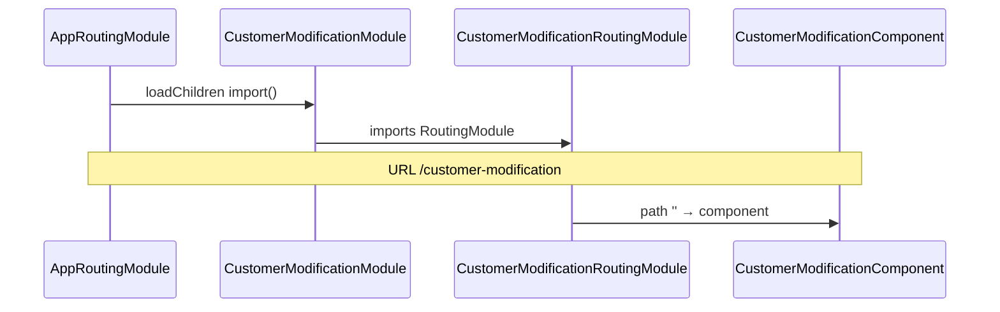

# `customer-modification-routing.module.ts`

> **Cómo leer este documento:** debajo de cada explicación hay un bloque **Código:** con el fragmento exacto del fichero fuente.

## Código fuente

Archivo: `src/app/features/customer-modification/customer-modification-routing.module.ts`

```typescript
import { NgModule } from '@angular/core';
import { RouterModule, Routes } from '@angular/router';
import { CustomerModificationComponent } from './components/customer-modification.component';

const routes: Routes = [
  { path: '', component: CustomerModificationComponent }
];

/**
 * CustomerModificationRoutingModule
 */
@NgModule({
  imports: [RouterModule.forChild(routes)],
  exports: [RouterModule],
})
export class CustomerModificationRoutingModule {}
```

---

**Ruta fuente:** `src/app/features/customer-modification/customer-modification-routing.module.ts`

## Rol

Define las **rutas hijas** del módulo lazy `CustomerModificationModule`. Al cargarse el feature desde `app-routing`, el router ya está en el segmento `customer-modification`; este módulo monta el componente raíz en el path vacío.

---

## Definición de rutas

```typescript
const routes: Routes = [
  { path: '', component: CustomerModificationComponent }
];
```

| Propiedad | Valor |
|-----------|--------|
| `path` | `''` — ruta por defecto del módulo feature |
| `component` | `CustomerModificationComponent` |
| `canActivate` | ninguno a nivel feature (auth en ruta padre) |

**URL completa de la app:** `/customer-modification` (sin segmentos adicionales).

No hay rutas hijas para pasos del wizard: los pasos son **estado interno del stepper Formly**, no rutas Angular.

---

## Módulo NgModule

```typescript
@NgModule({
  imports: [RouterModule.forChild(routes)],
  exports: [RouterModule],
})
export class CustomerModificationRoutingModule {}
```

- **`forChild`** — obligatorio en módulos lazy-loaded; registra rutas en el injector del feature sin redefinir la configuración global.
- **`exports: [RouterModule]`** — permite que `CustomerModificationModule` use `router-outlet` si hubiera plantillas con outlet (aquí el outlet está en el shell de la app).

---

## Flujo de carga lazy



1. Usuario navega a `/customer-modification`.
2. `authGuard` en ruta padre (ver `app-routing.module.ts.md`).
3. Se descarga el chunk del feature.
4. Se activa `CustomerModificationComponent`.

---

## Navegación saliente

El componente navega programáticamente a `/distributor` en cancelar y tras confirmar el modal — **no** define esas rutas aquí.

---

## Extensión futura

Si se quisiera deep-linking por paso:

```typescript
{ path: '', component: CustomerModificationComponent },
{ path: 'summary', component: CustomerModificationComponent, data: { step: 3 } }
```

Hoy no está implementado; la documentación refleja el diseño actual.

---

## Tests

No hay spec dedicado del routing module; el comportamiento se valida indirectamente en tests E2E o de integración del router raíz.
