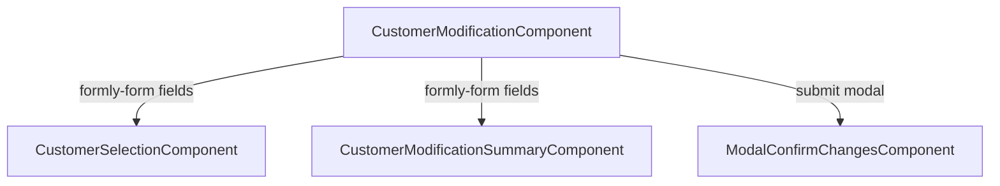

# `customer-modification.module.ts`

> **Cómo leer este documento:** debajo de cada explicación hay un bloque **Código:** con el fragmento exacto del fichero fuente.

## Código fuente

Archivo: `src/app/features/customer-modification/customer-modification.module.ts`

```typescript
import { CommonModule } from '@angular/common';
import { NgModule } from '@angular/core';
import { TranslateModule } from '@ngx-translate/core';
import { SharedModule } from '../../shared/shared.module';
import { FormlySharedModule } from '../../shared/types/formly.module';
import { FormlySharedModule as FormlySharedModuleLib } from '@sanes-hipdig/lf-ng-50084125-front-compones';
import { SharedModule as SharedModuleLib } from '@sanes-hipdig/lf-ng-50084125-front-compones';

import { CustomerModificationRoutingModule } from './customer-modification-routing.module';
import { CustomerModificationComponent } from './components/customer-modification.component';
import { CustomerSelectionComponent } from './components/customer-selection/customer-selection.component';
import { CustomerModificationSummaryComponent } from './components/customer-modification-summary/customer-modification-summary.component';
import { ModalConfirmChangesComponent } from './components/modal-confirm-changes/modal-confirm-changes.component';

/**
 * CustomerModificationModule
 *
 * Lazy-loaded module for the "Modificar cliente bancario" feature.
 */
@NgModule({
  declarations: [
    CustomerModificationComponent,
    CustomerSelectionComponent,
    CustomerModificationSummaryComponent,
    ModalConfirmChangesComponent,
  ],
  imports: [
    CommonModule,
    CustomerModificationRoutingModule,
    TranslateModule,
    SharedModule,
    FormlySharedModule,
    FormlySharedModuleLib,
    SharedModuleLib,
  ],
})
export class CustomerModificationModule {}
```

---

**Ruta fuente:** `src/app/features/customer-modification/customer-modification.module.ts`

## Rol

Módulo **feature** lazy-loaded que agrupa componentes, routing y dependencias compartidas para **Modificar cliente bancario**.

---

## Declarations

| Componente | Selector | Tipo Formly / UI |
|------------|----------|------------------|
| `CustomerModificationComponent` | `homeur-customer-modification` | Contenedor Formly |
| `CustomerSelectionComponent` | `homeur-customer-selection` | Tipo `customer-selection-radio` (registrado en `AppModule`) |
| `CustomerModificationSummaryComponent` | `homeur-customer-modification-summary` | Tipo `customer-modification-summary` |
| `ModalConfirmChangesComponent` | (modal) | Diálogo post-submit |

**Nota arquitectónica:** los tipos Formly `customer-selection-radio` y `customer-modification-summary` se registran en **`AppModule`** (constructor `FormlyConfig`), no en este módulo, porque el microfrontend arranca con `ngDoBootstrap` y la configuración Formly es global. Este módulo solo **declara** los componentes para que Angular los compile; el enlace nombre → componente ocurre en la raíz.

---

## Imports

```typescript
imports: [
  CommonModule,
  CustomerModificationRoutingModule,
  TranslateModule,
  SharedModule,
  FormlySharedModule,
  FormlySharedModuleLib,
  SharedModuleLib,
],
```

| Módulo | Función |
|--------|---------|
| `CommonModule` | Directivas `*ngIf`, pipes básicos, `@if` según versión Angular |
| `CustomerModificationRoutingModule` | Rutas hijas |
| `TranslateModule` | Pipe `translate` en plantillas hijas |
| `SharedModule` | Utilidades y componentes compartidos del proyecto |
| `FormlySharedModule` | Tipos Formly locales del repo |
| `FormlySharedModuleLib` / `SharedModuleLib` | Paquete `@sanes-hipdig/lf-ng-50084125-front-compones` (stepper, inputs, modales) |

No hay `providers` en el módulo: `CustomerModificationService` usa `providedIn: 'root'`.

---

## Lo que no incluye

- **Validadores** — en `AppModule._addFormlyTypes()`.
- **Servicios HTTP** — root injector.
- **Bootstrap** — el feature no se bootstrapea solo; lo carga el router.

---

## Carga lazy desde App

```typescript
loadChildren: () =>
  import('./features/customer-modification/customer-modification.module').then(
    (m) => m.CustomerModificationModule
  ),
```

El nombre exportado debe coincidir exactamente: `CustomerModificationModule`.

---

## Dependencias entre componentes



- Padre posee `model`, `fields`, `options`.
- Hijos leen `options.formState` vía `FieldType`.
- Modal independiente del formulario Formly.

---

## Comparación con NovationModule

Misma estructura: módulo feature + routing `path: ''` + componente contenedor Formly + tipos custom registrados en `AppModule`.

---

## Checklist al añadir un nuevo subcomponente

1. Declarar en `declarations`.
2. Si es tipo Formly, registrar en `AppModule` + JSON catálogo.
3. Añadir tests `.spec.ts` y documentación en `docs/`.
