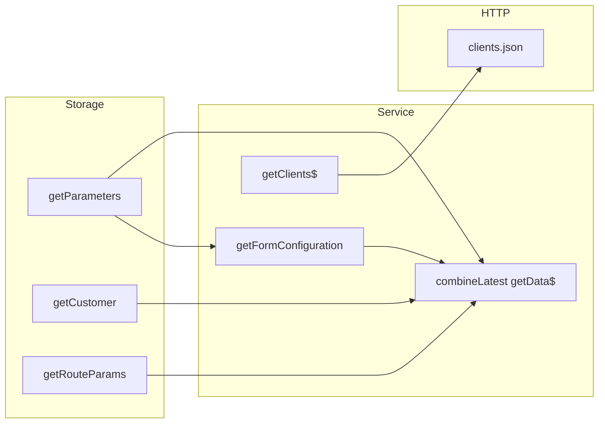

# `customer-modification.service.ts`

> **Cómo leer este documento:** debajo de cada explicación hay un bloque **Código:** con el fragmento exacto del fichero fuente.

## Código fuente

Archivo: `src/app/features/customer-modification/services/customer-modification.service.ts`

```typescript
import { Injectable, inject } from '@angular/core';
import { HttpClient, HttpHeaders } from '@angular/common/http';
import { catchError, combineLatest, map, Observable, of } from 'rxjs';
import { UtilsApi } from '@sanes-hipdig/lf-ng-50084125-front-compones';
import { StorageService } from '../../../core/services';
import { HttpHeadersEnum, HttpMethodEnum } from '../../../shared/enums/http-common.enum';
import { CustomerModificationClient } from '../../../shared/models/api/common/customer-modification.model';

/**
 * CustomerModificationService
 *
 * Handles data retrieval for the customer-modification feature:
 *   - parameters from the shared StorageService
 *   - the list of clients eligible for modification (via fake/mock endpoint)
 */
@Injectable({
  providedIn: 'root',
})
export class CustomerModificationService {
  private readonly _http = inject(HttpClient);
  private readonly _utilsApiService = inject(UtilsApi);
  private readonly _storageService = inject(StorageService);

  /**
   * Returns a combined stream of [parameters, customer, routeParams, formConfiguration]
   * following the exact same pattern used by other features (e.g. NovationService.getData$).
   *
   * @returns Observable<any[]>
   */
  getData$(): Observable<any> {
    return combineLatest([
      this._storageService.getParameters(),
      this._storageService.getCustomer(),
      this._storageService.getRouteParams(),
      this.getFormConfiguration(),
    ]);
  }

  /**
   * Returns just the customerModification section from the parameters catalogue.
   *
   * @returns Observable<any>
   */
  getFormConfiguration(): Observable<any> {
    return this._storageService
      .getParameters()
      .pipe(map(response => response?.mortgagesOriginationCatalogue.parameter.customerModification));
  }

  /**
   * Retrieves the list of clients available for modification.
   * The call is mocked so that mocked: true redirects to the local JSON file
   * at api/public/mocks/v1/customer-modification/clients.json.
   *
   * @returns Observable<CustomerModificationClient[]>
   */
  getClients$(): Observable<CustomerModificationClient[]> {
    const config = {
      url: 'v1/customer-modification/clients',
      // UtilsApi.getEndPointUrl appends '.json' for mocked endpoints.
      urlMock: 'v1/customer-modification/clients',
      mocked: true,
      httpMethod: HttpMethodEnum.get,
    };
    const headers = new HttpHeaders().set(HttpHeadersEnum.noError, 'true');

    return this._http
      .request<CustomerModificationClient[]>(config.httpMethod, this._utilsApiService.getEndPointUrl(config), { headers })
      .pipe(
        // Keep the flow alive if the mock/API is temporarily unavailable.
        catchError(() => of([]))
      );
  }
}
```

---

**Ruta fuente:** `src/app/features/customer-modification/services/customer-modification.service.ts`  
**Decorador:** `@Injectable({ providedIn: 'root' })`

## Propósito

Capa de datos de la feature **Modificar cliente bancario**:

1. Combinar parámetros de sesión, cliente, rutas y configuración del formulario Formly.
2. Extraer la sección `customerModification` del catálogo de hipotecas.
3. Obtener la lista de clientes modificables desde un endpoint **mock** (JSON local).

Sigue el mismo contrato que servicios hermanos (p. ej. novación): `getData$()` como punto de entrada del componente.

---

## Dependencias

| Inyección | Uso |
|-----------|-----|
| `HttpClient` | Petición GET de clientes. |
| `UtilsApi` | `getEndPointUrl(config)` — resuelve URL real o `.json` mock. |
| `StorageService` | Parámetros, cliente y `routeParams` reactivos. |

---

## `getData$()`

**Código:**

```typescript
getData$(): Observable<any> {
  return combineLatest([
    this._storageService.getParameters(),
    this._storageService.getCustomer(),
    this._storageService.getRouteParams(),
    this.getFormConfiguration(),
  ]);
}
```


```typescript
getData$(): Observable<any> {
  return combineLatest([
    this._storageService.getParameters(),
    this._storageService.getCustomer(),
    this._storageService.getRouteParams(),
    this.getFormConfiguration(),
  ]);
}
```

### Explicación detallada de `combineLatest`

- **Entrada:** cuatro observables (todos típicamente `Observable` que emiten desde store/sesión).
- **Salida:** un único observable que emite un **array de 4 posiciones** cada vez que **cualquier** fuente emite, usando el último valor conocido de las demás.
- **Primera emisión:** ocurre cuando las cuatro han emitido al menos una vez.
- **Orden de la tupla:** `[parameters, customer, routeParams, formConfiguration]`.

El componente consume:

```typescript
.subscribe(([parameters, , routerParams, formData]) => { ... })
```

`getFormConfiguration()` internamente vuelve a llamar a `getParameters()` y hace `map` a `customerModification`; por tanto **parameters puede suscribirse dos veces** en el combine — patrón aceptado en el proyecto para reutilizar el mismo stream de storage.

---

## `getFormConfiguration()`

**Código:**

```typescript
getFormConfiguration(): Observable<any> {
  return this._storageService
    .getParameters()
    .pipe(map(response => response?.mortgagesOriginationCatalogue.parameter.customerModification));
}
```


```typescript
return this._storageService
  .getParameters()
  .pipe(
    map(response =>
      response?.mortgagesOriginationCatalogue.parameter.customerModification
    ),
  );
```

**Ruta en el JSON de parámetros:**

```
mortgagesOriginationCatalogue
  └── parameter
        └── customerModification
              ├── form.fields   (stepper Formly)
              └── form.optionsData
```

En mocks locales puede cargarse desde `api/public/mocks/v1/parameters.json` o `parameters-customer-modification.json` según cómo esté montado el `StorageService` en desarrollo.

---

## `getClients$()`

**Código:**

```typescript
getClients$(): Observable<CustomerModificationClient[]> {
  const config = {
    url: 'v1/customer-modification/clients',
    urlMock: 'v1/customer-modification/clients',
    mocked: true,
    httpMethod: HttpMethodEnum.get,
  };
  const headers = new HttpHeaders().set(HttpHeadersEnum.noError, 'true');
  return this._http
    .request<CustomerModificationClient[]>(config.httpMethod, this._utilsApiService.getEndPointUrl(config), { headers })
    .pipe(catchError(() => of([])));
}
```


### Configuración de la petición

```typescript
const config = {
  url: 'v1/customer-modification/clients',
  urlMock: 'v1/customer-modification/clients',
  mocked: true,
  httpMethod: HttpMethodEnum.get,
};
const headers = new HttpHeaders().set(HttpHeadersEnum.noError, 'true');
```

| Campo | Significado |
|-------|-------------|
| `mocked: true` | `UtilsApi` sirve `v1/customer-modification/clients.json` |
| `no-error: true` | El interceptor no muestra pantalla de error global si falla |

### Archivo mock

**Ruta:** `api/public/mocks/v1/customer-modification/clients.json`

Contiene un array de `CustomerModificationClient` (ids 1–3 en el mock actual, con IBANs españoles válidos para pruebas de validador).

### Manejo de errores

```typescript
.pipe(catchError(() => of([])))
```

Cualquier fallo HTTP devuelve **array vacío** para que la UI muestre el estado “sin clientes” (`CUSTOMER_MODIFICATION.NO_CLIENTS`) en lugar de romper el flujo.

---

## Modelo de datos

Interfaz `CustomerModificationClient` (`shared/models/api/common/customer-modification.model.ts`):

| Campo | Tipo |
|-------|------|
| `id` | `number` |
| `fullName` | `string` |
| `document` | `string` |
| `email` | `string` |
| `phone` | `string` |
| `accountNumber` | `string` (IBAN) |
| `accountType` | `string` |
| `branchOffice` | `string` |
| `transferLimit` | `number` |
| `notificationsEnabled` | `boolean` |
| `preferredContactMethod` | `string` |

---

## Diagrama de datos



---

## Consumidores

- `CustomerModificationComponent` — único consumidor directo en la feature.
- Tests en `customer-modification.service.spec.ts`.
- Stub: `core/stubs/customer-modification.service.stub.ts` para tests de componentes hijos.

---

## Consideraciones de producción

- Con `mocked: false`, la URL real sería la API backend; el contrato del array debe mantenerse.
- `getData$` no cachea: cada suscripción del componente reacciona a cambios de storage.
- No hay persistencia del “guardado” del cliente: el submit solo abre modal y navega (demo).
