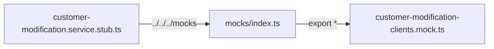

# Barrel: `src/app/mocks/index.ts`

> **Cómo leer este documento:** debajo de cada explicación hay un bloque **Código:** con el fragmento exacto del fichero fuente.

## Código fuente

Archivo: `src/app/mocks/index.ts`

```typescript
export * from './calculate-budget-body.mock';
export * from './customer-modification-clients.mock';
export * from './calculate-simulation-body.mock';
export * from './customer-response.mock';
export * from './mortgage-information-response.mock';
export * from './mortgages-origination-products.mock';
export * from './parameters-response.mock';
export * from './recalculate-budget-body.mock';
export * from './save-budget.mock';
export * from './save-budget.mock';
export * from './save-simulation-body.mock';
```

---

**Archivo fuente:** `src/app/mocks/index.ts`  
**Patrón:** **Barrel file** (archivo «barril») — un único punto de entrada que reexporta muchos mocks.

---

## ¿Qué es un barrel file?

Un **barrel** agrupa exportaciones de una carpeta para que otros módulos importen desde un solo sitio:

```typescript
// En lugar de:
import { CUSTOMER_MODIFICATION_CLIENTS_MOCK } from '../../../mocks/customer-modification-clients.mock';

// Puedes escribir:
import { CUSTOMER_MODIFICATION_CLIENTS_MOCK } from '../../../mocks';
// o, con alias de proyecto:
import { CUSTOMER_MODIFICATION_CLIENTS_MOCK } from 'src/app/mocks';
```

**Ventajas**

| Ventaja | Explicación |
|---------|-------------|
| Imports más cortos | Una ruta estable: la carpeta `mocks`. |
| Encapsulación | El consumidor no necesita saber el nombre de cada archivo `.mock.ts`. |
| Escalabilidad | Añades un mock nuevo → una línea `export *` en `index.ts`. |

**Desventaja habitual:** Algunos bundlers antiguos incluían todo el barrel aunque solo uses un símbolo; en Angular moderno el tree-shaking suele eliminar lo no usado si las exportaciones son estáticas.

---

## Patrón `export * from './archivo.mock'`


### Sintaxis

```typescript
export * from './customer-modification-clients.mock';
```

| Parte | Significado |
|-------|-------------|
| `export *` | Reexporta **todas** las exportaciones nombradas del archivo referenciado. |
| `from './customer-modification-clients.mock'` | Ruta relativa **sin** extensión `.ts` (resolución de módulos TypeScript). |

### Qué NO hace `export *`

- No reexporta un `export default` salvo que se importe y reexporte explícitamente.  
- No fusiona tipos con el mismo nombre de otro archivo (colisión → error de compilación).  
- No ejecuta código del mock al importar el barrel: solo enlaza referencias (salvo efectos secundarios en top-level del mock, poco habitual).

### Ejemplo concreto en este proyecto

`customer-modification-clients.mock.ts` contiene:

```typescript
export const CUSTOMER_MODIFICATION_CLIENTS_MOCK = [ ... ];
```

Tras pasar por el barrel, un consumidor puede hacer:

```typescript
import { CUSTOMER_MODIFICATION_CLIENTS_MOCK } from '../../../mocks';
```

TypeScript resuelve `../../../mocks` → `index.ts` → reexport → constante del archivo `.mock.ts`.

---

## Línea por línea del `index.ts` actual

| Línea | Archivo referenciado | Estado en workspace Eplicar (referencia) |
|-------|----------------------|----------------------------------------|
| 1 | `calculate-budget-body.mock` | Declarado en barrel; archivo puede existir en ramas completas del monorepo |
| 2 | **`customer-modification-clients.mock`** | **Presente** — mock usado por customer-modification |
| 3 | `calculate-simulation-body.mock` | Declarado en barrel |
| 4 | `customer-response.mock` | Declarado en barrel |
| 5 | `mortgage-information-response.mock` | Declarado en barrel |
| 6 | `mortgages-origination-products.mock` | Declarado en barrel |
| 7 | `parameters-response.mock` | Declarado en barrel |
| 8 | `recalculate-budget-body.mock` | Declarado en barrel |
| 9 | `save-budget.mock` | Declarado en barrel |
| 10 | **`save-budget.mock` (duplicado)** | Ver sección siguiente |
| 11 | `save-simulation-body.mock` | Declarado en barrel |

En un checkout mínimo solo existe `customer-modification-clients.mock.ts`; el barrel anticipa mocks de otras features (hipotecas, presupuesto, parámetros). Al añadir esos archivos, no hace falta cambiar los imports que ya apuntan al barrel.

---

## Línea duplicada: `save-budget.mock` (líneas 9 y 10)

```typescript
export * from './save-budget.mock';
export * from './save-budget.mock';
```

### Qué ocurre

| Pregunta | Respuesta |
|----------|-----------|
| ¿Es un error de TypeScript? | **No** en la mayoría de configuraciones: reexportar dos veces el mismo módulo es redundante, no conflictivo. |
| ¿Cambia el comportamiento? | **No**: el consumidor sigue viendo las mismas exportaciones una sola vez. |
| ¿Por qué suele estar duplicado? | Copiar/pegar al añadir líneas, merge de ramas, o resolución de conflicto git mal limpiado. |
| ¿Qué hacer? | Eliminar **una** de las dos líneas para claridad; funcionalmente es equivalente. |

**Principiante:** No es un patrón intencional «por seguridad»; es **ruido** que conviene quitar en una limpieza menor.

---

## Relación con imports desde `core/stubs`

`customer-modification.service.stub.ts` importa:

```typescript
import { CUSTOMER_MODIFICATION_CLIENTS_MOCK } from '../../../mocks';
```

Flujo:



Desde `src/app/core/stubs/`:

- `../../mocks` → carpeta `src/app/mocks` (recomendado si no hay alias).  
- `../../../mocks` → sube hasta `src/` y busca `mocks` allí; en estructuras estándar Angular los mocks están en `src/app/mocks`, no en `src/mocks`.

Documentación detallada de la ruta: ver `docs/src/app/core/stubs/customer-modification.service.stub.ts.md`.

---

## Buenas prácticas al trabajar con este barrel

1. **Un mock = un archivo** `nombre-descriptivo.mock.ts` con `export const NOMBRE_EN_MAYUS`.  
2. **Añadir una línea** `export * from './nuevo.mock';` al final (sin duplicar).  
3. **Evitar** `export *` de archivos enormes si solo necesitas un tipo en un sitio muy crítico de rendimiento (caso raro en tests).  
4. **Sincronizar** mocks TS con JSON en `api/public/mocks/` cuando representen el mismo contrato HTTP.

---

## Resumen para principiantes

- `index.ts` es el **índice** de la carpeta `mocks`.  
- `export * from '...'` **reexpone** todo lo exportado en cada archivo mock.  
- Permite imports cortos como `from '../../../mocks'`.  
- La línea **`save-budget.mock` repetida** no rompe nada pero sobra; bórrala una vez.  
- Hoy el mock activo de customer-modification es **`customer-modification-clients.mock`**; el resto de líneas preparan el mismo patrón para otras features.
