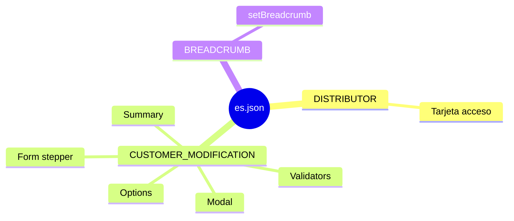

# `es.json` — traducciones Customer Modification

> **Cómo leer este documento:** debajo de cada explicación hay un bloque **Código:** con el fragmento exacto del fichero fuente.

## Código fuente

Archivo: `src/assets/i18n/es.json`

```json
{
  "DISTRIBUTOR": {
    "BE_INTERESTED": {
      "TITLE": "También te puede interesar",
      "HOME_IDENTIFICATION": {
        "TITLE": "Valorar una vivienda",
        "SUMMARY": "Calcula el valor de una vivienda con solo introducir su dirección"
      },
      "NOVATION": {
        "TITLE": "Modificar préstamo hipotecario",
        "SUMMARY": ""
      },
      "CUSTOMER_MODIFICATION": {
        "TITLE": "Modificar cliente bancario",
        "SUMMARY": ""
      },
      "CANCELLATION_OF_REGISTRATION": {
        "TITLE": "Certificado de deuda cero y cancelación registral",
        "SUMMARY": ""
      },
      "SELLING_HOUSE": {
        "TITLE": "Vender tu vivienda",
        "SUMMARY": ""
      },
      "RENT_HOUSE": {
        "TITLE": "Alquilar tu vivienda",
        "SUMMARY": ""
      },
      "INSURANCE_SIMULATE": {
        "TITLE": "Simular seguro de hogar",
        "SUMMARY": ""
      },
      "WORK_PROMOTIONS": {
        "TITLE": "Promociones de obra nueva",
        "SUMMARY": ""
      },
      "SOLAR_PANEL_ENERGY": {
        "TITLE": "Instalar paneles solares",
        "SUMMARY": ""
      },
      "CALCULATE_ENERGY_SAVINGS": {
        "TITLE": "Calcular ahorro energético",
        "SUMMARY": ""
      },
      "CONTRACT_ALARM": {
        "TITLE": "Contratar Alarma",
        "SUMMARY": ""
      }
    }
  },
  "CUSTOMER_MODIFICATION": {
    "NO_CLIENTS": "No hay clientes disponibles para modificar",
    "NO_CLIENTS_DESC": "Ahora mismo no hay clientes bancarios disponibles para esta operación.",
    "FORM": {
      "FIELDS": {
        "STEPS_LABELS": {
          "LABEL_1": "Seleccionar cliente",
          "LABEL_2": "Modificar datos",
          "LABEL_3": "Resumen"
        },
        "LABEL": "Modificar cliente",
        "SELECT_CLIENT": {
          "TITLE": "Selecciona el cliente bancario",
          "DESCRIPTION": "Elige el cliente que quieres modificar"
        },
        "MODIFY_DATA": {
          "TITLE": "Modifica los datos del cliente",
          "DESCRIPTION": "Actualiza los campos necesarios y continúa"
        },
        "FULL_NAME": {
          "LABEL": "Nombre completo"
        },
        "EMAIL": {
          "LABEL": "Correo electrónico"
        },
        "PHONE": {
          "LABEL": "Teléfono"
        },
        "ACCOUNT_NUMBER": {
          "LABEL": "IBAN"
        },
        "ACCOUNT_TYPE": {
          "LABEL": "Tipo de cuenta"
        },
        "BRANCH_OFFICE": {
          "LABEL": "Oficina"
        },
        "TRANSFER_LIMIT": {
          "LABEL": "Límite de transferencia"
        },
        "NOTIFICATIONS": {
          "LABEL": "Notificaciones"
        },
        "PREFERRED_CONTACT": {
          "LABEL": "Canal de contacto preferido"
        }
      }
    },
    "SUMMARY": {
      "TITLE": "Datos modificados",
      "DISCLAIMER": "Esta información es una previsualización de los datos modificados.",
      "NO_CHANGES": "No se han detectado cambios"
    },
    "MODAL": {
      "TITLE": "Cambios guardados",
      "TEXT": "La modificación del cliente se ha realizado correctamente",
      "ACCEPT": "Aceptar"
    },
    "OPTIONS": {
      "ACCOUNT_TYPE": {
        "PAYROLL": "Cuenta Nómina",
        "SAVINGS": "Cuenta Ahorro",
        "BUSINESS": "Cuenta Empresa",
        "PREMIUM": "Cuenta Premium"
      },
      "PREFERRED_CONTACT": {
        "EMAIL": "Correo electrónico",
        "PHONE": "Teléfono",
        "SMS": "SMS"
      }
    },
    "VALIDATORS": {
      "NO_NUMBERS": "Este campo no puede contener números",
      "EMAIL_FORMAT": "Introduce un correo electrónico válido",
      "ONLY_NUMBERS": "Este campo solo permite números",
      "MAX_NINE_DIGITS": "Este campo admite un máximo de 9 dígitos",
      "IBAN_FORMAT": "Introduce un IBAN válido",
      "TRANSFER_LIMIT_RANGE": "El límite debe estar entre 0 y 3000"
    }
  },
  "BREADCRUMB": {
    "DISTRIBUTOR_TITLE": "Mi vivienda - Simuladores - Contratación hipoteca",
    "ATTRACTING_TITLE": "Mejora hipoteca",
    "OTHERSURVEY_TITLE": "Financiar proyecto",
    "DASHBOARD_TITLE": "Home planner",
    "SIMULATION_TITLE": "Simular tu hipoteca",
    "NOVATION_TITLE": "Modificar préstamo hipotecario",
    "CUSTOMER_MODIFICATION_TITLE": "Modificar cliente bancario",
    "LOAN": "Préstamo",
    "DETAIL": "Detalle",
    "MY_HOME": "Mi vivienda"
  }
}
```

---

**Ruta fuente:** `src/assets/i18n/es.json`  
**Cargador:** `CustomTranslateLoader` (`AppModule` → `TranslateModule.forRoot`)  
**Idioma:** español (`es`)

Este fichero contiene **solo un subconjunto** de claves del microfrontend completo; en este documento se detallan **todos los grupos presentes en el archivo** y su uso en la feature de modificación de cliente.

---

## Convenciones

| Notación | Significado |
|----------|-------------|
| Clave completa | Ruta con puntos para `TranslateService.instant()` o `translate` pipe |
| `textSlot` / `labelText` en Formly | La clave se pasa tal cual; Formly/lib traduce en runtime |
| Claves vacías `""` | Reservadas; UI puede ocultar descripción o usar fallback |

---

## Grupo `DISTRIBUTOR`

**Código:**

```json
{
  "DISTRIBUTOR": {
    "BE_INTERESTED": {
      "TITLE": "También te puede interesar",
      "HOME_IDENTIFICATION": {
        "TITLE": "Valorar una vivienda",
        "SUMMARY": "Calcula el valor de una vivienda con solo introducir su dirección"
      },
      "NOVATION": {
        "TITLE": "Modificar préstamo hipotecario",
        "SUMMARY": ""
      },
      "CUSTOMER_MODIFICATION": {
        "TITLE": "Modificar cliente bancario",
        "SUMMARY": ""
      },
      "CANCELLATION_OF_REGISTRATION": {
        "TITLE": "Certificado de deuda cero y cancelación registral",
        "SUMMARY": ""
      },
      "SELLING_HOUSE": {
        "TITLE": "Vender tu vivienda",
        "SUMMARY": ""
      },
      "RENT_HOUSE": {
        "TITLE": "Alquilar tu vivienda",
        "SUMMARY": ""
      },
      "INSURANCE_SIMULATE": {
        "TITLE": "Simular seguro de hogar",
        "SUMMARY": ""
      },
      "WORK_PROMOTIONS": {
        "TITLE": "Promociones de obra nueva",
        "SUMMARY": ""
      },
      "SOLAR_PANEL_ENERGY": {
        "TITLE": "Instalar paneles solares",
        "SUMMARY": ""
      },
      "CALCULATE_ENERGY_SAVINGS": {
        "TITLE": "Calcular ahorro energético",
        "SUMMARY": ""
      },
      "CONTRACT_ALARM": {
        "TITLE": "Contratar Alarma",
        "SUMMARY": ""
      }
    }
  }
}
```


**Fragmento de código:**

```json
"DISTRIBUTOR": {
    "BE_INTERESTED": {
      "TITLE": "También te puede interesar",
      "HOME_IDENTIFICATION": {
        "TITLE": "Valorar una vivienda",
        "SUMMARY": "Calcula el valor de una vivienda con solo introducir su dirección"
      },
      "NOVATION": {
        "TITLE": "Modificar préstamo hipotecario",
        "SUMMARY": ""
      },
      "CUSTOMER_MODIFICATION": {
        "TITLE": "Modificar cliente bancario",
        "SUMMARY": ""
      },
      "CANCELLATION_OF_REGISTRATION": {
        "TITLE": "Certificado de deuda cero y cancelación registral",
        "SUMMARY": ""
      },
      "SELLING_HOUSE": {
        "TITLE": "Vender tu vivienda",
        "SUMMARY": ""
      },
      "RENT_HOUSE": {
        "TITLE": "Alquilar tu vivienda",
        "SUMMARY": ""
      },
      "INSURANCE_SIMULATE": {
        "TITLE": "Simular seguro de hogar",
        "SUMMARY": ""
      },
      "WORK_PROMOTIONS": {
        "TITLE": "Promociones de obra nueva",
        "SUMMARY": ""
      },
      "SOLAR_PANEL_ENERGY": {
        "TITLE": "Instalar paneles solares",
        "SUMMARY": ""
      },
      "CALCULATE_ENERGY_SAVINGS": {
        "TITLE": "Calcular ahorro energético",
        "SUMMARY": ""
      },
      "CONTRACT_ALARM": {
        "TITLE": "Contratar Alarma",
        "SUMMARY": ""
      }
    }
  }
```


Sección del **distribuidor** (“Mi vivienda” / simuladores). En este JSON solo aparece el bloque anidado `BE_INTERESTED`.

### `DISTRIBUTOR.BE_INTERESTED`

**Código:**

```json
{
  "DISTRIBUTOR": {
    "BE_INTERESTED": {
      "TITLE": "También te puede interesar",
      "HOME_IDENTIFICATION": {
        "TITLE": "Valorar una vivienda",
        "SUMMARY": "Calcula el valor de una vivienda con solo introducir su dirección"
      },
      "NOVATION": {
        "TITLE": "Modificar préstamo hipotecario",
        "SUMMARY": ""
      },
      "CUSTOMER_MODIFICATION": {
        "TITLE": "Modificar cliente bancario",
        "SUMMARY": ""
      },
      "CANCELLATION_OF_REGISTRATION": {
        "TITLE": "Certificado de deuda cero y cancelación registral",
        "SUMMARY": ""
      },
      "SELLING_HOUSE": {
        "TITLE": "Vender tu vivienda",
        "SUMMARY": ""
      },
      "RENT_HOUSE": {
        "TITLE": "Alquilar tu vivienda",
        "SUMMARY": ""
      },
      "INSURANCE_SIMULATE": {
        "TITLE": "Simular seguro de hogar",
        "SUMMARY": ""
      },
      "WORK_PROMOTIONS": {
        "TITLE": "Promociones de obra nueva",
        "SUMMARY": ""
      },
      "SOLAR_PANEL_ENERGY": {
        "TITLE": "Instalar paneles solares",
        "SUMMARY": ""
      },
      "CALCULATE_ENERGY_SAVINGS": {
        "TITLE": "Calcular ahorro energético",
        "SUMMARY": ""
      },
      "CONTRACT_ALARM": {
        "TITLE": "Contratar Alarma",
        "SUMMARY": ""
      }
    }
  }
}
```


**Uso:** carrusel o lista “También te puede interesar” en el distribuidor. Cada hijo define `TITLE` y `SUMMARY` para una tarjeta de acceso.

| Clave | Texto ES | Uso en producto |
|-------|----------|-----------------|
| `TITLE` | También te puede interesar | Cabecera de la sección |
| `HOME_IDENTIFICATION.TITLE` | Valorar una vivienda | Tarjeta valoración |
| `HOME_IDENTIFICATION.SUMMARY` | Calcula el valor… | Subtítulo |
| `NOVATION.TITLE` | Modificar préstamo hipotecario | Tarjeta novación |
| `NOVATION.SUMMARY` | *(vacío)* | |
| **`CUSTOMER_MODIFICATION.TITLE`** | **Modificar cliente bancario** | **Tarjeta de esta feature** |
| **`CUSTOMER_MODIFICATION.SUMMARY`** | *(vacío)* | Subtítulo tarjeta (sin copy) |
| `CANCELLATION_OF_REGISTRATION.TITLE` | Certificado de deuda cero… | |
| `SELLING_HOUSE.TITLE` | Vender tu vivienda | |
| `RENT_HOUSE.TITLE` | Alquilar tu vivienda | |
| `INSURANCE_SIMULATE.TITLE` | Simular seguro de hogar | |
| `WORK_PROMOTIONS.TITLE` | Promociones de obra nueva | |
| `SOLAR_PANEL_ENERGY.TITLE` | Instalar paneles solares | |
| `CALCULATE_ENERGY_SAVINGS.TITLE` | Calcular ahorro energético | |
| `CONTRACT_ALARM.TITLE` | Contratar Alarma | |

**Enlace técnico:** en catálogo mock, el ítem customer modification usa:

```json
"title": "DISTRIBUTOR.BE_INTERESTED.CUSTOMER_MODIFICATION.TITLE",
"path": "/customer-modification"
```

---

## Grupo `CUSTOMER_MODIFICATION`

**Código:**

```json
{
  "CUSTOMER_MODIFICATION": {
    "NO_CLIENTS": "No hay clientes disponibles para modificar",
    "NO_CLIENTS_DESC": "Ahora mismo no hay clientes bancarios disponibles para esta operación.",
    "FORM": {
      "FIELDS": {
        "STEPS_LABELS": {
          "LABEL_1": "Seleccionar cliente",
          "LABEL_2": "Modificar datos",
          "LABEL_3": "Resumen"
        },
        "LABEL": "Modificar cliente",
        "SELECT_CLIENT": {
          "TITLE": "Selecciona el cliente bancario",
          "DESCRIPTION": "Elige el cliente que quieres modificar"
        },
        "MODIFY_DATA": {
          "TITLE": "Modifica los datos del cliente",
          "DESCRIPTION": "Actualiza los campos necesarios y continúa"
        },
        "FULL_NAME": {
          "LABEL": "Nombre completo"
        },
        "EMAIL": {
          "LABEL": "Correo electrónico"
        },
        "PHONE": {
          "LABEL": "Teléfono"
        },
        "ACCOUNT_NUMBER": {
          "LABEL": "IBAN"
        },
        "ACCOUNT_TYPE": {
          "LABEL": "Tipo de cuenta"
        },
        "BRANCH_OFFICE": {
          "LABEL": "Oficina"
        },
        "TRANSFER_LIMIT": {
          "LABEL": "Límite de transferencia"
        },
        "NOTIFICATIONS": {
          "LABEL": "Notificaciones"
        },
        "PREFERRED_CONTACT": {
          "LABEL": "Canal de contacto preferido"
        }
      }
    },
    "SUMMARY": {
      "TITLE": "Datos modificados",
      "DISCLAIMER": "Esta información es una previsualización de los datos modificados.",
      "NO_CHANGES": "No se han detectado cambios"
    },
    "MODAL": {
      "TITLE": "Cambios guardados",
      "TEXT": "La modificación del cliente se ha realizado correctamente",
      "ACCEPT": "Aceptar"
    },
    "OPTIONS": {
      "ACCOUNT_TYPE": {
        "PAYROLL": "Cuenta Nómina",
        "SAVINGS": "Cuenta Ahorro",
        "BUSINESS": "Cuenta Empresa",
        "PREMIUM": "Cuenta Premium"
      },
      "PREFERRED_CONTACT": {
        "EMAIL": "Correo electrónico",
        "PHONE": "Teléfono",
        "SMS": "SMS"
      }
    },
    "VALIDATORS": {
      "NO_NUMBERS": "Este campo no puede contener números",
      "EMAIL_FORMAT": "Introduce un correo electrónico válido",
      "ONLY_NUMBERS": "Este campo solo permite números",
      "MAX_NINE_DIGITS": "Este campo admite un máximo de 9 dígitos",
      "IBAN_FORMAT": "Introduce un IBAN válido",
      "TRANSFER_LIMIT_RANGE": "El límite debe estar entre 0 y 3000"
    }
  }
}
```


**Fragmento de código:**

```json
"CUSTOMER_MODIFICATION": {
        "TITLE": "Modificar cliente bancario",
        "SUMMARY": ""
      }
```


Bloque principal de la feature. Todas las claves bajo este prefijo.

### `CUSTOMER_MODIFICATION.NO_CLIENTS`

**Código:**

```json
{
  "CUSTOMER_MODIFICATION": {
    "NO_CLIENTS": "No hay clientes disponibles para modificar",
    "NO_CLIENTS_DESC": "Ahora mismo no hay clientes bancarios disponibles para esta operación.",
    "FORM": {
      "FIELDS": {
        "STEPS_LABELS": {
          "LABEL_1": "Seleccionar cliente",
          "LABEL_2": "Modificar datos",
          "LABEL_3": "Resumen"
        },
        "LABEL": "Modificar cliente",
        "SELECT_CLIENT": {
          "TITLE": "Selecciona el cliente bancario",
          "DESCRIPTION": "Elige el cliente que quieres modificar"
        },
        "MODIFY_DATA": {
          "TITLE": "Modifica los datos del cliente",
          "DESCRIPTION": "Actualiza los campos necesarios y continúa"
        },
        "FULL_NAME": {
          "LABEL": "Nombre completo"
        },
        "EMAIL": {
          "LABEL": "Correo electrónico"
        },
        "PHONE": {
          "LABEL": "Teléfono"
        },
        "ACCOUNT_NUMBER": {
          "LABEL": "IBAN"
        },
        "ACCOUNT_TYPE": {
          "LABEL": "Tipo de cuenta"
        },
        "BRANCH_OFFICE": {
          "LABEL": "Oficina"
        },
        "TRANSFER_LIMIT": {
          "LABEL": "Límite de transferencia"
        },
        "NOTIFICATIONS": {
          "LABEL": "Notificaciones"
        },
        "PREFERRED_CONTACT": {
          "LABEL": "Canal de contacto preferido"
        }
      }
    },
    "SUMMARY": {
      "TITLE": "Datos modificados",
      "DISCLAIMER": "Esta información es una previsualización de los datos modificados.",
      "NO_CHANGES": "No se han detectado cambios"
    },
    "MODAL": {
      "TITLE": "Cambios guardados",
      "TEXT": "La modificación del cliente se ha realizado correctamente",
      "ACCEPT": "Aceptar"
    },
    "OPTIONS": {
      "ACCOUNT_TYPE": {
        "PAYROLL": "Cuenta Nómina",
        "SAVINGS": "Cuenta Ahorro",
        "BUSINESS": "Cuenta Empresa",
        "PREMIUM": "Cuenta Premium"
      },
      "PREFERRED_CONTACT": {
        "EMAIL": "Correo electrónico",
        "PHONE": "Teléfono",
        "SMS": "SMS"
      }
    },
    "VALIDATORS": {
      "NO_NUMBERS": "Este campo no puede contener números",
      "EMAIL_FORMAT": "Introduce un correo electrónico válido",
      "ONLY_NUMBERS": "Este campo solo permite números",
      "MAX_NINE_DIGITS": "Este campo admite un máximo de 9 dígitos",
      "IBAN_FORMAT": "Introduce un IBAN válido",
      "TRANSFER_LIMIT_RANGE": "El límite debe estar entre 0 y 3000"
    }
  }
}
```


| Clave | Texto |
|-------|--------|
| `NO_CLIENTS` | No hay clientes disponibles para modificar |

**Uso:** `CustomerSelectionComponent` cuando `formState.clients.length === 0`.

### `CUSTOMER_MODIFICATION.NO_CLIENTS_DESC`

**Código:**

```json
{
  "CUSTOMER_MODIFICATION": {
    "NO_CLIENTS": "No hay clientes disponibles para modificar",
    "NO_CLIENTS_DESC": "Ahora mismo no hay clientes bancarios disponibles para esta operación.",
    "FORM": {
      "FIELDS": {
        "STEPS_LABELS": {
          "LABEL_1": "Seleccionar cliente",
          "LABEL_2": "Modificar datos",
          "LABEL_3": "Resumen"
        },
        "LABEL": "Modificar cliente",
        "SELECT_CLIENT": {
          "TITLE": "Selecciona el cliente bancario",
          "DESCRIPTION": "Elige el cliente que quieres modificar"
        },
        "MODIFY_DATA": {
          "TITLE": "Modifica los datos del cliente",
          "DESCRIPTION": "Actualiza los campos necesarios y continúa"
        },
        "FULL_NAME": {
          "LABEL": "Nombre completo"
        },
        "EMAIL": {
          "LABEL": "Correo electrónico"
        },
        "PHONE": {
          "LABEL": "Teléfono"
        },
        "ACCOUNT_NUMBER": {
          "LABEL": "IBAN"
        },
        "ACCOUNT_TYPE": {
          "LABEL": "Tipo de cuenta"
        },
        "BRANCH_OFFICE": {
          "LABEL": "Oficina"
        },
        "TRANSFER_LIMIT": {
          "LABEL": "Límite de transferencia"
        },
        "NOTIFICATIONS": {
          "LABEL": "Notificaciones"
        },
        "PREFERRED_CONTACT": {
          "LABEL": "Canal de contacto preferido"
        }
      }
    },
    "SUMMARY": {
      "TITLE": "Datos modificados",
      "DISCLAIMER": "Esta información es una previsualización de los datos modificados.",
      "NO_CHANGES": "No se han detectado cambios"
    },
    "MODAL": {
      "TITLE": "Cambios guardados",
      "TEXT": "La modificación del cliente se ha realizado correctamente",
      "ACCEPT": "Aceptar"
    },
    "OPTIONS": {
      "ACCOUNT_TYPE": {
        "PAYROLL": "Cuenta Nómina",
        "SAVINGS": "Cuenta Ahorro",
        "BUSINESS": "Cuenta Empresa",
        "PREMIUM": "Cuenta Premium"
      },
      "PREFERRED_CONTACT": {
        "EMAIL": "Correo electrónico",
        "PHONE": "Teléfono",
        "SMS": "SMS"
      }
    },
    "VALIDATORS": {
      "NO_NUMBERS": "Este campo no puede contener números",
      "EMAIL_FORMAT": "Introduce un correo electrónico válido",
      "ONLY_NUMBERS": "Este campo solo permite números",
      "MAX_NINE_DIGITS": "Este campo admite un máximo de 9 dígitos",
      "IBAN_FORMAT": "Introduce un IBAN válido",
      "TRANSFER_LIMIT_RANGE": "El límite debe estar entre 0 y 3000"
    }
  }
}
```


| Clave | Texto |
|-------|--------|
| `NO_CLIENTS_DESC` | Ahora mismo no hay clientes bancarios disponibles para esta operación. |

**Uso:** descripción del estado vacío bajo el título anterior.

---

### `CUSTOMER_MODIFICATION.FORM`

**Código:**

```json
{
  "CUSTOMER_MODIFICATION": {
    "NO_CLIENTS": "No hay clientes disponibles para modificar",
    "NO_CLIENTS_DESC": "Ahora mismo no hay clientes bancarios disponibles para esta operación.",
    "FORM": {
      "FIELDS": {
        "STEPS_LABELS": {
          "LABEL_1": "Seleccionar cliente",
          "LABEL_2": "Modificar datos",
          "LABEL_3": "Resumen"
        },
        "LABEL": "Modificar cliente",
        "SELECT_CLIENT": {
          "TITLE": "Selecciona el cliente bancario",
          "DESCRIPTION": "Elige el cliente que quieres modificar"
        },
        "MODIFY_DATA": {
          "TITLE": "Modifica los datos del cliente",
          "DESCRIPTION": "Actualiza los campos necesarios y continúa"
        },
        "FULL_NAME": {
          "LABEL": "Nombre completo"
        },
        "EMAIL": {
          "LABEL": "Correo electrónico"
        },
        "PHONE": {
          "LABEL": "Teléfono"
        },
        "ACCOUNT_NUMBER": {
          "LABEL": "IBAN"
        },
        "ACCOUNT_TYPE": {
          "LABEL": "Tipo de cuenta"
        },
        "BRANCH_OFFICE": {
          "LABEL": "Oficina"
        },
        "TRANSFER_LIMIT": {
          "LABEL": "Límite de transferencia"
        },
        "NOTIFICATIONS": {
          "LABEL": "Notificaciones"
        },
        "PREFERRED_CONTACT": {
          "LABEL": "Canal de contacto preferido"
        }
      }
    },
    "SUMMARY": {
      "TITLE": "Datos modificados",
      "DISCLAIMER": "Esta información es una previsualización de los datos modificados.",
      "NO_CHANGES": "No se han detectado cambios"
    },
    "MODAL": {
      "TITLE": "Cambios guardados",
      "TEXT": "La modificación del cliente se ha realizado correctamente",
      "ACCEPT": "Aceptar"
    },
    "OPTIONS": {
      "ACCOUNT_TYPE": {
        "PAYROLL": "Cuenta Nómina",
        "SAVINGS": "Cuenta Ahorro",
        "BUSINESS": "Cuenta Empresa",
        "PREMIUM": "Cuenta Premium"
      },
      "PREFERRED_CONTACT": {
        "EMAIL": "Correo electrónico",
        "PHONE": "Teléfono",
        "SMS": "SMS"
      }
    },
    "VALIDATORS": {
      "NO_NUMBERS": "Este campo no puede contener números",
      "EMAIL_FORMAT": "Introduce un correo electrónico válido",
      "ONLY_NUMBERS": "Este campo solo permite números",
      "MAX_NINE_DIGITS": "Este campo admite un máximo de 9 dígitos",
      "IBAN_FORMAT": "Introduce un IBAN válido",
      "TRANSFER_LIMIT_RANGE": "El límite debe estar entre 0 y 3000"
    }
  }
}
```


Contenedor de textos del formulario Formly.

#### `CUSTOMER_MODIFICATION.FORM.FIELDS.STEPS_LABELS`

**Código:**

```json
{
  "LABEL_1": "Seleccionar cliente",
  "LABEL_2": "Modificar datos",
  "LABEL_3": "Resumen"
}
```


| Clave | Texto | Paso stepper |
|-------|--------|--------------|
| `LABEL_1` | Seleccionar cliente | 1 |
| `LABEL_2` | Modificar datos | 2 |
| `LABEL_3` | Resumen | 3 |

**Uso:** `templateOptions.stepsLabels` del tipo `stepper` en JSON catálogo.

#### `CUSTOMER_MODIFICATION.FORM.FIELDS.LABEL`

**Código:**

```json
{
  "LABEL": "Modificar cliente"
}
```


| Clave | Texto |
|-------|--------|
| `LABEL` | Modificar cliente |

**Uso:** etiqueta global del stepper (`templateOptions.label`).

#### `CUSTOMER_MODIFICATION.FORM.FIELDS.SELECT_CLIENT`

**Código:**

```json
{
  "TITLE": "Selecciona el cliente bancario",
  "DESCRIPTION": "Elige el cliente que quieres modificar"
}
```


| Clave | Texto |
|-------|--------|
| `TITLE` | Selecciona el cliente bancario |
| `DESCRIPTION` | Elige el cliente que quieres modificar |

**Uso:** campos `title` y `text` del paso 1 en catálogo.

#### `CUSTOMER_MODIFICATION.FORM.FIELDS.MODIFY_DATA`

**Código:**

```json
{
  "TITLE": "Modifica los datos del cliente",
  "DESCRIPTION": "Actualiza los campos necesarios y continúa"
}
```


| Clave | Texto |
|-------|--------|
| `TITLE` | Modifica los datos del cliente |
| `DESCRIPTION` | Actualiza los campos necesarios y continúa |

**Uso:** cabecera del paso 2.

#### Campos individuales (`FORM.FIELDS.*.LABEL`)

| Clave | Texto | `key` Formly |
|-------|--------|--------------|
| `FULL_NAME.LABEL` | Nombre completo | `fullName` |
| `EMAIL.LABEL` | Correo electrónico | `email` |
| `PHONE.LABEL` | Teléfono | `phone` |
| `ACCOUNT_NUMBER.LABEL` | IBAN | `accountNumber` |
| `ACCOUNT_TYPE.LABEL` | Tipo de cuenta | `accountType` |
| `BRANCH_OFFICE.LABEL` | Oficina | `branchOffice` |
| `TRANSFER_LIMIT.LABEL` | Límite de transferencia | `transferLimit` |
| `NOTIFICATIONS.LABEL` | Notificaciones | `notificationsEnabled` |
| `PREFERRED_CONTACT.LABEL` | Canal de contacto preferido | `preferredContactMethod` |

**Uso adicional:** en `CustomerModificationComponent._calculateChanges()`, `label` del diff guarda la **clave i18n** (p. ej. `CUSTOMER_MODIFICATION.FORM.FIELDS.EMAIL.LABEL`), no el texto resuelto; el resumen traduce al mostrar.

---

### `CUSTOMER_MODIFICATION.SUMMARY`

**Código:**

```json
{
  "CUSTOMER_MODIFICATION": {
    "NO_CLIENTS": "No hay clientes disponibles para modificar",
    "NO_CLIENTS_DESC": "Ahora mismo no hay clientes bancarios disponibles para esta operación.",
    "FORM": {
      "FIELDS": {
        "STEPS_LABELS": {
          "LABEL_1": "Seleccionar cliente",
          "LABEL_2": "Modificar datos",
          "LABEL_3": "Resumen"
        },
        "LABEL": "Modificar cliente",
        "SELECT_CLIENT": {
          "TITLE": "Selecciona el cliente bancario",
          "DESCRIPTION": "Elige el cliente que quieres modificar"
        },
        "MODIFY_DATA": {
          "TITLE": "Modifica los datos del cliente",
          "DESCRIPTION": "Actualiza los campos necesarios y continúa"
        },
        "FULL_NAME": {
          "LABEL": "Nombre completo"
        },
        "EMAIL": {
          "LABEL": "Correo electrónico"
        },
        "PHONE": {
          "LABEL": "Teléfono"
        },
        "ACCOUNT_NUMBER": {
          "LABEL": "IBAN"
        },
        "ACCOUNT_TYPE": {
          "LABEL": "Tipo de cuenta"
        },
        "BRANCH_OFFICE": {
          "LABEL": "Oficina"
        },
        "TRANSFER_LIMIT": {
          "LABEL": "Límite de transferencia"
        },
        "NOTIFICATIONS": {
          "LABEL": "Notificaciones"
        },
        "PREFERRED_CONTACT": {
          "LABEL": "Canal de contacto preferido"
        }
      }
    },
    "SUMMARY": {
      "TITLE": "Datos modificados",
      "DISCLAIMER": "Esta información es una previsualización de los datos modificados.",
      "NO_CHANGES": "No se han detectado cambios"
    },
    "MODAL": {
      "TITLE": "Cambios guardados",
      "TEXT": "La modificación del cliente se ha realizado correctamente",
      "ACCEPT": "Aceptar"
    },
    "OPTIONS": {
      "ACCOUNT_TYPE": {
        "PAYROLL": "Cuenta Nómina",
        "SAVINGS": "Cuenta Ahorro",
        "BUSINESS": "Cuenta Empresa",
        "PREMIUM": "Cuenta Premium"
      },
      "PREFERRED_CONTACT": {
        "EMAIL": "Correo electrónico",
        "PHONE": "Teléfono",
        "SMS": "SMS"
      }
    },
    "VALIDATORS": {
      "NO_NUMBERS": "Este campo no puede contener números",
      "EMAIL_FORMAT": "Introduce un correo electrónico válido",
      "ONLY_NUMBERS": "Este campo solo permite números",
      "MAX_NINE_DIGITS": "Este campo admite un máximo de 9 dígitos",
      "IBAN_FORMAT": "Introduce un IBAN válido",
      "TRANSFER_LIMIT_RANGE": "El límite debe estar entre 0 y 3000"
    }
  }
}
```


| Clave | Texto | Uso |
|-------|--------|-----|
| `TITLE` | Datos modificados | Título paso 3 |
| `DISCLAIMER` | Esta información es una previsualización… | Aviso legal/informativo |
| `NO_CHANGES` | No se han detectado cambios | `CustomerModificationSummaryComponent` sin diff |

---

### `CUSTOMER_MODIFICATION.MODAL`

**Código:**

```json
{
  "CUSTOMER_MODIFICATION": {
    "NO_CLIENTS": "No hay clientes disponibles para modificar",
    "NO_CLIENTS_DESC": "Ahora mismo no hay clientes bancarios disponibles para esta operación.",
    "FORM": {
      "FIELDS": {
        "STEPS_LABELS": {
          "LABEL_1": "Seleccionar cliente",
          "LABEL_2": "Modificar datos",
          "LABEL_3": "Resumen"
        },
        "LABEL": "Modificar cliente",
        "SELECT_CLIENT": {
          "TITLE": "Selecciona el cliente bancario",
          "DESCRIPTION": "Elige el cliente que quieres modificar"
        },
        "MODIFY_DATA": {
          "TITLE": "Modifica los datos del cliente",
          "DESCRIPTION": "Actualiza los campos necesarios y continúa"
        },
        "FULL_NAME": {
          "LABEL": "Nombre completo"
        },
        "EMAIL": {
          "LABEL": "Correo electrónico"
        },
        "PHONE": {
          "LABEL": "Teléfono"
        },
        "ACCOUNT_NUMBER": {
          "LABEL": "IBAN"
        },
        "ACCOUNT_TYPE": {
          "LABEL": "Tipo de cuenta"
        },
        "BRANCH_OFFICE": {
          "LABEL": "Oficina"
        },
        "TRANSFER_LIMIT": {
          "LABEL": "Límite de transferencia"
        },
        "NOTIFICATIONS": {
          "LABEL": "Notificaciones"
        },
        "PREFERRED_CONTACT": {
          "LABEL": "Canal de contacto preferido"
        }
      }
    },
    "SUMMARY": {
      "TITLE": "Datos modificados",
      "DISCLAIMER": "Esta información es una previsualización de los datos modificados.",
      "NO_CHANGES": "No se han detectado cambios"
    },
    "MODAL": {
      "TITLE": "Cambios guardados",
      "TEXT": "La modificación del cliente se ha realizado correctamente",
      "ACCEPT": "Aceptar"
    },
    "OPTIONS": {
      "ACCOUNT_TYPE": {
        "PAYROLL": "Cuenta Nómina",
        "SAVINGS": "Cuenta Ahorro",
        "BUSINESS": "Cuenta Empresa",
        "PREMIUM": "Cuenta Premium"
      },
      "PREFERRED_CONTACT": {
        "EMAIL": "Correo electrónico",
        "PHONE": "Teléfono",
        "SMS": "SMS"
      }
    },
    "VALIDATORS": {
      "NO_NUMBERS": "Este campo no puede contener números",
      "EMAIL_FORMAT": "Introduce un correo electrónico válido",
      "ONLY_NUMBERS": "Este campo solo permite números",
      "MAX_NINE_DIGITS": "Este campo admite un máximo de 9 dígitos",
      "IBAN_FORMAT": "Introduce un IBAN válido",
      "TRANSFER_LIMIT_RANGE": "El límite debe estar entre 0 y 3000"
    }
  }
}
```


| Clave | Texto | Uso |
|-------|--------|-----|
| `TITLE` | Cambios guardados | `ModalConfirmChangesComponent` |
| `TEXT` | La modificación del cliente se ha realizado correctamente | Cuerpo |
| `ACCEPT` | Aceptar | Botón principal |

---

### `CUSTOMER_MODIFICATION.OPTIONS`

**Código:**

```json
{
  "CUSTOMER_MODIFICATION": {
    "NO_CLIENTS": "No hay clientes disponibles para modificar",
    "NO_CLIENTS_DESC": "Ahora mismo no hay clientes bancarios disponibles para esta operación.",
    "FORM": {
      "FIELDS": {
        "STEPS_LABELS": {
          "LABEL_1": "Seleccionar cliente",
          "LABEL_2": "Modificar datos",
          "LABEL_3": "Resumen"
        },
        "LABEL": "Modificar cliente",
        "SELECT_CLIENT": {
          "TITLE": "Selecciona el cliente bancario",
          "DESCRIPTION": "Elige el cliente que quieres modificar"
        },
        "MODIFY_DATA": {
          "TITLE": "Modifica los datos del cliente",
          "DESCRIPTION": "Actualiza los campos necesarios y continúa"
        },
        "FULL_NAME": {
          "LABEL": "Nombre completo"
        },
        "EMAIL": {
          "LABEL": "Correo electrónico"
        },
        "PHONE": {
          "LABEL": "Teléfono"
        },
        "ACCOUNT_NUMBER": {
          "LABEL": "IBAN"
        },
        "ACCOUNT_TYPE": {
          "LABEL": "Tipo de cuenta"
        },
        "BRANCH_OFFICE": {
          "LABEL": "Oficina"
        },
        "TRANSFER_LIMIT": {
          "LABEL": "Límite de transferencia"
        },
        "NOTIFICATIONS": {
          "LABEL": "Notificaciones"
        },
        "PREFERRED_CONTACT": {
          "LABEL": "Canal de contacto preferido"
        }
      }
    },
    "SUMMARY": {
      "TITLE": "Datos modificados",
      "DISCLAIMER": "Esta información es una previsualización de los datos modificados.",
      "NO_CHANGES": "No se han detectado cambios"
    },
    "MODAL": {
      "TITLE": "Cambios guardados",
      "TEXT": "La modificación del cliente se ha realizado correctamente",
      "ACCEPT": "Aceptar"
    },
    "OPTIONS": {
      "ACCOUNT_TYPE": {
        "PAYROLL": "Cuenta Nómina",
        "SAVINGS": "Cuenta Ahorro",
        "BUSINESS": "Cuenta Empresa",
        "PREMIUM": "Cuenta Premium"
      },
      "PREFERRED_CONTACT": {
        "EMAIL": "Correo electrónico",
        "PHONE": "Teléfono",
        "SMS": "SMS"
      }
    },
    "VALIDATORS": {
      "NO_NUMBERS": "Este campo no puede contener números",
      "EMAIL_FORMAT": "Introduce un correo electrónico válido",
      "ONLY_NUMBERS": "Este campo solo permite números",
      "MAX_NINE_DIGITS": "Este campo admite un máximo de 9 dígitos",
      "IBAN_FORMAT": "Introduce un IBAN válido",
      "TRANSFER_LIMIT_RANGE": "El límite debe estar entre 0 y 3000"
    }
  }
}
```


Valores de selects/toggles; en catálogo las `label` apuntan aquí y `TranslateOptionsService` las resuelve.

#### `CUSTOMER_MODIFICATION.OPTIONS.ACCOUNT_TYPE`

**Código:**

```json
{
  "PAYROLL": "Cuenta Nómina",
  "SAVINGS": "Cuenta Ahorro",
  "BUSINESS": "Cuenta Empresa",
  "PREMIUM": "Cuenta Premium"
}
```


| Clave | Texto | `value` típico en mock |
|-------|--------|-------------------------|
| `PAYROLL` | Cuenta Nómina | Cuenta Nómina |
| `SAVINGS` | Cuenta Ahorro | Cuenta Ahorro |
| `BUSINESS` | Cuenta Empresa | Cuenta Empresa |
| `PREMIUM` | Cuenta Premium | Cuenta Premium |

#### `CUSTOMER_MODIFICATION.OPTIONS.PREFERRED_CONTACT`

**Código:**

```json
{
  "EMAIL": "Correo electrónico",
  "PHONE": "Teléfono",
  "SMS": "SMS"
}
```


| Clave | Texto | `value` |
|-------|--------|---------|
| `EMAIL` | Correo electrónico | EMAIL |
| `PHONE` | Teléfono | PHONE |
| `SMS` | SMS | SMS |

**Nota:** oficinas (`branchOfficeOptions`) en mock usan label literal (“Madrid Centro”), no claves bajo `OPTIONS`.

---

### `CUSTOMER_MODIFICATION.VALIDATORS`

**Código:**

```json
{
  "CUSTOMER_MODIFICATION": {
    "NO_CLIENTS": "No hay clientes disponibles para modificar",
    "NO_CLIENTS_DESC": "Ahora mismo no hay clientes bancarios disponibles para esta operación.",
    "FORM": {
      "FIELDS": {
        "STEPS_LABELS": {
          "LABEL_1": "Seleccionar cliente",
          "LABEL_2": "Modificar datos",
          "LABEL_3": "Resumen"
        },
        "LABEL": "Modificar cliente",
        "SELECT_CLIENT": {
          "TITLE": "Selecciona el cliente bancario",
          "DESCRIPTION": "Elige el cliente que quieres modificar"
        },
        "MODIFY_DATA": {
          "TITLE": "Modifica los datos del cliente",
          "DESCRIPTION": "Actualiza los campos necesarios y continúa"
        },
        "FULL_NAME": {
          "LABEL": "Nombre completo"
        },
        "EMAIL": {
          "LABEL": "Correo electrónico"
        },
        "PHONE": {
          "LABEL": "Teléfono"
        },
        "ACCOUNT_NUMBER": {
          "LABEL": "IBAN"
        },
        "ACCOUNT_TYPE": {
          "LABEL": "Tipo de cuenta"
        },
        "BRANCH_OFFICE": {
          "LABEL": "Oficina"
        },
        "TRANSFER_LIMIT": {
          "LABEL": "Límite de transferencia"
        },
        "NOTIFICATIONS": {
          "LABEL": "Notificaciones"
        },
        "PREFERRED_CONTACT": {
          "LABEL": "Canal de contacto preferido"
        }
      }
    },
    "SUMMARY": {
      "TITLE": "Datos modificados",
      "DISCLAIMER": "Esta información es una previsualización de los datos modificados.",
      "NO_CHANGES": "No se han detectado cambios"
    },
    "MODAL": {
      "TITLE": "Cambios guardados",
      "TEXT": "La modificación del cliente se ha realizado correctamente",
      "ACCEPT": "Aceptar"
    },
    "OPTIONS": {
      "ACCOUNT_TYPE": {
        "PAYROLL": "Cuenta Nómina",
        "SAVINGS": "Cuenta Ahorro",
        "BUSINESS": "Cuenta Empresa",
        "PREMIUM": "Cuenta Premium"
      },
      "PREFERRED_CONTACT": {
        "EMAIL": "Correo electrónico",
        "PHONE": "Teléfono",
        "SMS": "SMS"
      }
    },
    "VALIDATORS": {
      "NO_NUMBERS": "Este campo no puede contener números",
      "EMAIL_FORMAT": "Introduce un correo electrónico válido",
      "ONLY_NUMBERS": "Este campo solo permite números",
      "MAX_NINE_DIGITS": "Este campo admite un máximo de 9 dígitos",
      "IBAN_FORMAT": "Introduce un IBAN válido",
      "TRANSFER_LIMIT_RANGE": "El límite debe estar entre 0 y 3000"
    }
  }
}
```


Mensajes enlazados en `AppModule` → `validationMessages`.

| Clave | Texto | Validador |
|-------|--------|-----------|
| `NO_NUMBERS` | Este campo no puede contener números | `noNumbersValidator` |
| `EMAIL_FORMAT` | Introduce un correo electrónico válido | `emailFormatValidator` |
| `ONLY_NUMBERS` | Este campo solo permite números | `onlyNumbersValidator` |
| `MAX_NINE_DIGITS` | Este campo admite un máximo de 9 dígitos | `maxNineDigitsValidator` |
| `IBAN_FORMAT` | Introduce un IBAN válido | `ibanFormatValidator` |
| `TRANSFER_LIMIT_RANGE` | El límite debe estar entre 0 y 3000 | `transferLimitRangeValidator` |

---

## Grupo `BREADCRUMB`

**Código:**

```json
{
  "BREADCRUMB": {
    "DISTRIBUTOR_TITLE": "Mi vivienda - Simuladores - Contratación hipoteca",
    "ATTRACTING_TITLE": "Mejora hipoteca",
    "OTHERSURVEY_TITLE": "Financiar proyecto",
    "DASHBOARD_TITLE": "Home planner",
    "SIMULATION_TITLE": "Simular tu hipoteca",
    "NOVATION_TITLE": "Modificar préstamo hipotecario",
    "CUSTOMER_MODIFICATION_TITLE": "Modificar cliente bancario",
    "LOAN": "Préstamo",
    "DETAIL": "Detalle",
    "MY_HOME": "Mi vivienda"
  }
}
```


**Fragmento de código:**

```json
"BREADCRUMB": {
    "DISTRIBUTOR_TITLE": "Mi vivienda - Simuladores - Contratación hipoteca",
    "ATTRACTING_TITLE": "Mejora hipoteca",
    "OTHERSURVEY_TITLE": "Financiar proyecto",
    "DASHBOARD_TITLE": "Home planner",
    "SIMULATION_TITLE": "Simular tu hipoteca",
    "NOVATION_TITLE": "Modificar préstamo hipotecario",
    "CUSTOMER_MODIFICATION_TITLE": "Modificar cliente bancario",
    "LOAN": "Préstamo",
    "DETAIL": "Detalle",
    "MY_HOME": "Mi vivienda"
  }
```


Migas de pan del shell cuando hay parámetros de ruta.

| Clave | Texto | Uso en customer modification |
|-------|--------|-------------------------------|
| `DISTRIBUTOR_TITLE` | Mi vivienda - Simuladores - Contratación hipoteca | Primer nivel breadcrumb |
| **`CUSTOMER_MODIFICATION_TITLE`** | **Modificar cliente bancario** | Segundo nivel — `CommunicationService.setBreadcrumb` |
| `ATTRACTING_TITLE` | Mejora hipoteca | Otras features |
| `OTHERSURVEY_TITLE` | Financiar proyecto | |
| `DASHBOARD_TITLE` | Home planner | |
| `SIMULATION_TITLE` | Simular tu hipoteca | |
| `NOVATION_TITLE` | Modificar préstamo hipotecario | |
| `LOAN` | Préstamo | |
| `DETAIL` | Detalle | |
| `MY_HOME` | Mi vivienda | |

Código en componente:

```typescript
this._communicationService.setBreadcrumb([
  { title: 'BREADCRUMB.DISTRIBUTOR_TITLE' },
  { title: 'BREADCRUMB.CUSTOMER_MODIFICATION_TITLE' },
]);
```

---

## Claves referenciadas pero no en este `es.json`

El catálogo y componentes pueden usar claves de **otros ficheros** i18n del MF:

| Clave | Contexto |
|-------|----------|
| `ACTIONS.CONTINUE` | Botones paso 1 y 2 |
| `ACTIONS.REQUEST_MODIFICATION` | Submit stepper |
| `ACTIONS.SEARCH` | Modal oficina |
| `OPTIONS_DATA.YES_NO.YES.LABEL` / `NO.LABEL` | Booleanos en resumen |

Documentar en los JSON donde existan.

---

## Mapa clave → archivo de código



---

## Mantenimiento

1. Añadir clave en `es.json` (y resto de idiomas del MF si aplica).
2. Referenciar en JSON catálogo o `validationMessages`.
3. Para opciones dinámicas, usar `label` con clave i18n en `optionsData` + `TranslateOptionsService`.
4. Evitar texto hardcodeado en componentes salvo fallbacks (`getAccountTypeLabel`).

---

## Ejemplo de estructura JSON (fragmento)

```json
"CUSTOMER_MODIFICATION": {
  "NO_CLIENTS": "...",
  "FORM": { "FIELDS": { "EMAIL": { "LABEL": "..." } } },
  "VALIDATORS": { "IBAN_FORMAT": "..." }
}
```

Árbol completo: ver `src/assets/i18n/es.json` en el repositorio (144 líneas en la versión documentada).
